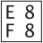

## <a id="style-font-selection">フォントの選択</a>

文書の中で、どのフォントが選ばれるかを説明します。
どのフォントが使えるかは組版を呼び出す側の設定で決まります
(<b>フォントの設定</b>(pdfg2d の説明書))。

### <a id="admin-config-fonts-select">ドキュメント中でのフォントの利用</a>

ドキュメント中で使用されるフォントを特定するためのCSSプロパティは font-family(ファミリ名),
font-weight(太さ), font-size(大きさ),
font-style(スタイル) の４つです(fontプロパティでまとめて指定することもできます)。
指定されたファミリ名、太さ、スタイルから、記述された文字を表記できる最も近いフォントが選択されます。

該当する太さのフォントが見つからない場合は、機械的に文字の輪郭を拡張して太いフォントがつくられます
(逆に指定した太さより細いフォントがない場合、機械的に細いフォントをつくることは**ありません**。
最も細いフォントが使われるだけです)。
この機械的な太らせと、後述の機械的な傾き(疑似イタリック)は、
font-synthesisプロパティ4.0.0で抑止できます
(font-synthesis: none;で両方、
font-synthesis-weight / font-synthesis-styleで個別に指定します。
抑止した場合は手持ちのフォントのまま描かれます)。

また、font-styleにitalicまたはobliqueが指定されたとき、
斜体スタイルのフォントが見つからない場合は、フォントを機械的に傾けます。 同時にfont-weightが指定されている場合は、
以下の表のとおり、font-styleの指定がitalicかobliqueかで選択されるフォントが異なることがあります。

**フォントスタイルの選択**

| 条件 | italic指定の場合 | oblique指定の場合 |
| --- | --- | --- |
| 太さとスタイルが一致するフォントがある | 太さとスタイルが一致するフォントを使用する | 太さとスタイルが一致するフォントを使用する |
| 太さだけ一致するフォントがある | 太さが一致するフォントを傾けて使用する | 太さが一致するフォントを傾けて使用する |
| スタイルだけ一致するフォントがある | スタイルが一致するフォントを太くして使用する | スタイルが一致するフォントを太くして使用する |
| 太さだけ一致するフォントとスタイルだけ一致するフォントがある | スタイルが一致するフォントを太くして使用する | 太さが一致するフォントを傾けて使用する |
| 太さもスタイルも一致するフォントがない | 他の条件が一致するフォントを太くして傾けて使用する | 他の条件が一致するフォントを太くして傾けて使用する |

### <a id="admin-config-fonts-default-font">デフォルトのフォント</a>

ドキュメント中でフォントが指定されていない場合、あるいは指定されたフォントが見つからない場合は、 output.default-font-family
により設定されたフォントが使われます。 これはデフォルトではserif(ローマンあるいは明朝体)です。

**CMap**(pdfg2d の説明書)に該当するコードがない、
コアフォントにも該当する文字がない、かつインストール済みのフォントにも該当する文字がないといった理由で、
どうしても表示できない文字がドキュメント中に記述された場合は、
代わりに16進数でユニコードを表す組文字(のような文字)が表示されます。

