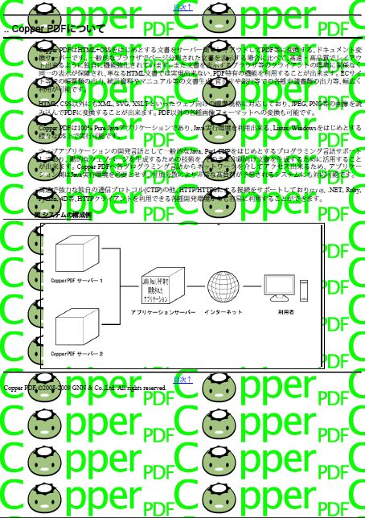
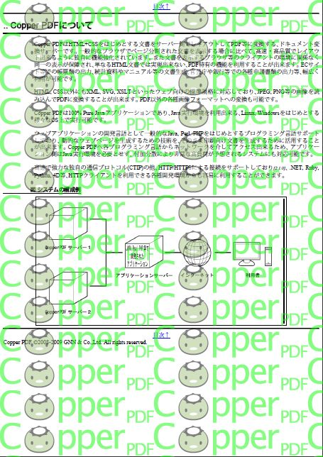

## <a id="style-output">出力するファイル形式</a>

長らくPDFが唯一の出力形式でしたが、
2.0.3から画像の出力をサポートしました。

<span class="ioprop">output.type</span>にMIMEタイプを設定することにより、
出力形式を切り替えることができます。 デフォルトではPDF("application/pdf")です。

### <a id="style-output-pdf">PDFの出力</a>

既定ではPDFを出力します。 PDF出力機能の詳細は<a class="pageref"
	href="#style-pdf-version">PDFの機能</a>を参照してください。

#### <a id="style-pdf-version">PDFのバージョンと機能</a>

出力するPDFのバージョンは <span class="ioprop">output.pdf.version</span>
で設定します。既定は1.5です。

この設定には**2つの役割**があります。

<dl>

<dt>使える機能を決める</dt>
<dd>PDFの機能はバージョンごとに増えてきました。古いバージョンを指定すると、
	そのバージョンに無い機能は使えません。指定したバージョンで使えない機能を
	使おうとすると<b>警告が出て、その機能はPDFに反映されません</b>
	(変換自体は成功します)。</dd>
<dt>準拠プロファイルを選ぶ</dt>
<dd>PDF/AやPDF/Xのように、用途ごとに「守るべき決まり」を定めた規格があります。
	これもこのプロパティで指定します。</dd>

</dl>

#### ふつうのPDFを出す場合

数字だけを指定します。1.2から1.7、および2.0が指定できます。

| 値 | このバージョン以降で使えるようになるもの |
| --- | --- |
| 1.3 | 40〜128ビットの暗号化 |
| 1.4 | ファイルの添付、PNGの半透明、SVGの透明度 |
| 1.5 | JPEG 2000画像、オブジェクトストリーム(ファイルが小さくなる) |
| 1.7 | 添付ファイル名のUnicode、AES-256暗号化 |
| 2.0 | PDF 2.0(ISO 32000-2) |

**特に理由がなければ既定の1.5のままで構いません。**
古い閲覧環境に配る必要がある場合だけ下げてください。

#### <a id="style-pdf-profiles">準拠プロファイル</a>

長期保存や印刷入稿のために、PDFには「この決まりを守っていること」を
保証する規格があります<span class="since">4.0.0</span>。
用途から選んでください。

<dl>

<dt>PDF/A —— 長期保存</dt>
<dd>10年後、20年後でも同じ見た目で開けることを目指した規格です。
	フォントを必ず埋め込む、外部のファイルに依存しない、といった決まりがあります。
	<b>公文書や、長く保管する契約書・帳票</b>に使います。</dd>
<dt>PDF/X —— 印刷入稿</dt>
<dd>印刷所へ渡すための規格です。色の指定や断ち代の情報が揃っていることを
	保証します。<b>商業印刷に出す</b>場合に使います。</dd>
<dt>PDF/UA —— アクセシビリティ</dt>
<dd>読み上げソフトなどで正しく読めることを保証する規格です。
	見出しや表の構造がPDFの中に記録されます。
	<b>公共機関の文書など、誰でも読める必要がある</b>場合に使います。</dd>

</dl>

指定する値は「**ベースのPDFバージョン + 規格名 - 番号**」という形です。
例えば`1.7A-2u`は「PDF 1.7をベースにしたPDF/A-2、適合レベルu」という意味です。

| 値 | 規格 | 補足 |
| --- | --- | --- |
| 1.4A-1 | PDF/A-1b | 最も古く、制約が厳しい(透明が使えないなど) |
| 1.7A-2 | PDF/A-2b | 透明・AES暗号・添付が使える |
| 1.7A-2u | PDF/A-2u | 上に加え、全ての文字がUnicodeで取り出せる |
| 1.7A-2a | PDF/A-2a | 上に加え、論理構造(タグ)が必要 |
| 1.7A-3 | PDF/A-3b | 任意のファイルを添付できる(電子インボイス等) |
| 1.7A-3a | PDF/A-3a | 上に加え、論理構造が必要 |
| 2.0A-4 | PDF/A-4 | PDF 2.0がベース |
| 1.4X-1 | PDF/X-1a:2003 | 古い入稿規格。CMYKのみ |
| 1.6X-4 | PDF/X-4 | ICCベースのRGB、透明が使える |
| 2.0X-6 | PDF/X-6 | PDF 2.0がベース |
| 1.7UA-1 | PDF/UA-1 | アクセシブルなタグ付きPDF |

**どれを選べばよいか分からない場合**は、長期保存なら`1.7A-2`、
印刷入稿なら`1.6X-4`、アクセシビリティなら`1.7UA-1`または`2.0UA-2`(PDF/UA-2)<span class="since">4.0.0</span>から試してください。

#### プロファイルを指定すると自動的に変わること

準拠のために、いくつかの設定が自動的に上書きされます。

<dl>

<dt>フォントは必ず埋め込まれます</dt>
<dd>PDF/A・PDF/Xでは、フォントの埋め込みが必須です。
	<b>埋め込みが許可されたフォントを用意してください。</b>
	埋め込めないフォント(コアフォント、CID-Keyedフォント)しか無いと準拠できません。
	**フォントの設定**(pdfg2d の説明書)を参照してください。</dd>
<dt>暗号化はできません</dt>
<dd>PDF/A・PDF/Xでは暗号化が禁止されています。
	<span class="ioprop">output.pdf.encryption</span>を設定しても警告が出て無視されます。</dd>
<dt>タグ付けが自動で有効になります</dt>
<dd>レベルaのPDF/A(1.7A-2a、1.7A-3a)とPDF/UA(1.7UA-1、2.0UA-2)では論理構造が必須なので、
	<span class="ioprop">output.pdf.tagged</span>を設定しなくても自動で有効になります。
	PDF/UA-1では<span class="ioprop">output.pdf.tagged.lang</span>による
	言語の指定が<b>必須</b>です。</dd>

</dl>

#### <a id="style-pdf-bidi">双方向テキストの抽出</a>

<dl>
<dt>抽出器の双方向処理に任せます</dt>
<dd>右横書き(ヘブライ語・アラビア語など)を含む行は、字形を視覚順に置き、論理順の復元は閲覧環境の
	双方向アルゴリズムに任せます(ChromeやEdgeのPDF閲覧はこの方式で論理順を正しく復元します)。
	鏡像化した括弧類も表示した字形の文字(ToUnicode)のまま出し、閲覧環境の鏡像処理に任せます。タグ付きPDFでは
	構造要素の内容順(<code>/K</code>)を論理順で出します。</dd>
<dt><span class="ioprop">output.pdf.bidi.actual-text</span><span class="since">4.0.0</span></dt>
<dd><code>true</code>にすると、並べ替えた行ごとに論理順の文字列を<code>ActualText</code>として付け、鏡像化した
	括弧類には論理文字のToUnicodeを持つ別CIDを使います(既定は<code>false</code>)。Acrobatのように<code>ActualText</code>を尊重する抽出器向けで、PDFiumやMuPDFでは
	かえって抽出順が崩れるため既定では付けません。PDF 1.5以上でのみ有効です。</dd>
</dl>

#### <a id="style-pdf-encryption">暗号化</a>

暗号化したPDFを出力することができます。
パスワードを設定して暗号化したPDFは、パスワードがなければ閲覧不可能になります。
また、内容のコピーなどPDFの利用制限を設定するためにも暗号化が必要で、
広く配布するPDFのためにパスワードを設定せず、暗号化だけしたPDFを出力することができます。

暗号化は、 <span class="ioprop">output.pdf.encryption</span> の設定で有効となります。
次の方式が選べます。

| 値 | 方式 | 必要なPDFバージョン |
| --- | --- | --- |
| v1 | Arcfour 40ビット | 制限なし |
| v2 | Arcfour 40〜128ビット | 1.3以降 |
| v4 | Arcfour 128ビット / AES-128 | 1.5以降(AES-128は1.6以降) |
| v5 | AES-256 | 1.7以降 |

**新しく作るなら`v5`(AES-256)を選んでください**<span class="since">4.0.0</span>。
古い閲覧環境に配る必要がある場合は`v2`を使います。
`v4`ではArcfour(`v2`)とAES-128(`aesv2`)のどちらを使うかを
<span class="ioprop">output.pdf.encryption.v4.cfm</span>で選びます。

暗号強度(暗号化キーのビット数)は <span class="ioprop">output.pdf.encryption.length</span>
で設定できます。v2でのみ有効で、v4は128ビット、v5は256ビットに固定です。
デフォルトでは最も強い暗号化がされるため、通常は設定の必要はありません。

<div class="note">

PDF/A・PDF/Xでは暗号化が禁止されています。設定しても警告が出て無視されます。

</div>

閲覧のためのパスワードは <span class="ioprop">output.pdf.encryption.user-password</span>
で設定することができます。 このプロパティを設定しなかった場合は、暗号化だけされて誰でも開くことができるPDFが生成されます。 さらに <span
	class="ioprop">output.pdf.encryption.owner-password</span> でAdobe
Acrobat等で文書の編集をするためのパスワードを設定することができます。

PDFを暗号化する場合は、パーミッションを設定することができます。
パーミッションはoutput.pdf.encryption.permissionsで開始する、
次の8種類の入出力プロパティで設定することができます。 true(有効)またはfalse(無効)で設定してください。
デフォルトでは全て有効です。

<dl>

<dt class="ioprop">output.pdf.encryption.permissions.print</dt>
<dd>印刷</dd>

</dl>

<dl>

<dt class="ioprop">output.pdf.encryption.permissions.modify</dt>
<dd>内容の変更</dd>

</dl>

<dl>

<dt class="ioprop">output.pdf.encryption.permissions.copy</dt>
<dd>テキストや画像のコピー</dd>

</dl>

<dl>

<dt class="ioprop">output.pdf.encryption.permissions.add</dt>
<dd>注釈の追加、変更とPDFフォームへの入力</dd>

</dl>

次の4つはv2暗号化でのみ有効です。

<dl>

<dt class="ioprop">output.pdf.encryption.permissions.fill</dt>
<dd>PDFフォームへの入力</dd>

</dl>

<dl>

<dt class="ioprop">output.pdf.encryption.permissions.extract</dt>
<dd>障害を持つユーザーのための文書中のテキストや画像の抽出</dd>

</dl>

<dl>

<dt class="ioprop">output.pdf.encryption.permissions.assemble</dt>
<dd>文書中に新しいページ、ブックマーク、サムネイル画像を追加する</dd>

</dl>

<dl>

<dt class="ioprop">output.pdf.encryption.permissions.print-high</dt>
<dd>文書を高画質で印刷する</dd>

</dl>

なお、フォームに対する権限は<span class="ioprop">output.pdf.forms</span>=trueでHTMLフォームを
入力可能なPDFフォーム(AcroForm)として出力する場合に意味を持ちます(既定では出力しません)。

<p class="note">パーミッションを設定することにより、Adobe
	Reader等のPDF閲覧ソフトは設定に沿った動作をしますが、
	他のツール等でPDFに対する該当する操作が行われないことを保証するものではありません。</p>

#### <a id="style-pdf-forms">入力できるPDFフォーム(AcroForm)<span class="since">4.0.0</span></a>

<span class="ioprop">output.pdf.forms</span>をtrueにすると、
HTMLのフォーム部品を**PDF上で入力できるフォームフィールド**として出力します。
既定はfalseで、そのときフォーム部品は見た目だけが描かれます。

```
session.property("output.pdf.forms", "true");
```

対応するHTMLの部品は次のとおりです。

| HTML | PDFのフィールド |
| --- | --- |
| `input type="text"`(および`password`、`search`・`email`などのHTML5の型) | テキストフィールド。`maxlength`は最大文字数として反映します |
| `input type="checkbox"` | チェックボックス。`value`がオンの値、`checked`が初期状態です |
| `input type="radio"` | ラジオボタン。**同じname属性のものが1つのフィールドにまとまります** |
| `input type="submit" / "reset" / "button"` | プッシュボタン |
| `textarea` | 複数行のテキストフィールド |
| `select` | 選択フィールド。option要素が選択肢になります |

`title`属性はフィールドの補足説明(ツールチップ)になります。
`disabled`属性を付けると入力できないフィールドになります。

次のものはフィールドにしません。`input type="hidden"`、
`input type="file"`、`input type="image"`です。

<div class="note">

**PDF/Xでは対話フォームを出力できません。**
この場合は設定に関わらずフィールドを作らず、見た目だけを描きます。

フォームを含まない文書の出力は、この設定を変えても変わりません。

</div>

#### <a id="style-pdf-attachments">ファイルの添付</a>

PDF 1.4以降では、PDFにファイルを添付することができます。 ファイルの添付は

- <span class="ioprop">output.pdf.attachments.<i>n</i>.name</span>
- <span class="ioprop">output.pdf.attachments.<i>n</i>.description</span>
- <span class="ioprop">output.pdf.attachments.<i>n</i>.mime-type</span>
- <span class="ioprop">output.pdf.attachments.<i>n</i>.uri</span>

の4つで1組のプロパティを使います。 <i>n</i>は0から始まる通し番号で、複数のファイルを添付することができます。

このうち必須なのは<span class="ioprop">output.pdf.attachments.<i>n</i>.uri</span>です。 あらかじめドライバにより送られてきたファイルのURIか、 アクセス可能なファイルのURLを設定してください。

<span class="ioprop">output.pdf.attachments.<i>n</i>.name</span>はファイルの名前です。 ASCII文字以外も使用することができますが、文字化けが発生するおそれがあります。
日本語ファイル名を使用する場合は、 <span class="ioprop">output.pdf.attachments.<i>n</i>.name</span>にはなるべくASCII文字を使い、 <span class="ioprop">output.pdf.attachments.<i>n</i>.description</span>
に実際のファイル名を設定してください。

<span class="ioprop">output.pdf.attachments.<i>n</i>.mime-type</span>は、 ファイルのMIMEタイプです。

<span class="ioprop">output.pdf.attachments.<i>n</i>.relationship</span><span class="since">4.0.0</span>は、
添付ファイルと本文の関係です。`Data`(本文の元になったデータ)、
`Source`(元原稿)、`Alternative`(本文と同じ内容の別表現)、
`Supplement`(補足)、`Unspecified`のいずれかを指定します。
電子インボイスのように**添付が本文と同じ内容を表す**場合は
`Alternative`を指定してください。

#### <a id="style-pdf-facturx">電子インボイス(Factur-X / ZUGFeRD)<span class="since">4.0.0</span></a>

請求書のPDFに、機械処理できるXMLを添付する規格です。フランスでは
2026年9月から、ドイツでは2027年1月から、事業者間の請求書で
順次義務化されます。

PDF/A-3(`1.7A-3`)で出力し、XMLを`Alternative`として添付したうえで、
<span class="ioprop">output.pdf.facturx.conformance-level</span>を
設定すると、Factur-Xとして必要なXMPメタデータが埋め込まれます。

```
output.pdf.version=1.7A-3
output.pdf.attachments.0.uri=file:///path/to/factur-x.xml
output.pdf.attachments.0.name=factur-x.xml
output.pdf.attachments.0.mime-type=text/xml
output.pdf.attachments.0.relationship=Alternative
output.pdf.facturx.conformance-level=EN 16931
```

添付ファイル名(既定`factur-x.xml`)・文書種別(既定`INVOICE`)・
版(既定`1.0`)は、それぞれ
<span class="ioprop">output.pdf.facturx.document-file-name</span>・
<span class="ioprop">output.pdf.facturx.document-type</span>・
<span class="ioprop">output.pdf.facturx.version</span>で変更できます。

<div class="note">

XMLの中身は検証しません。規格に沿ったXMLを渡してください。

</div>

#### <a id="style-pdf-output-intent">出力インテント(色の基準)<span class="since">4.0.0</span></a>

**PDF/Xでは、どの印刷条件を前提とした色なのかをPDFに記録することが
求められます**。これを出力インテントと呼びます。

**印刷所から指定されたプロファイルを使うのが第一です。**日本の印刷所では
Japan Color 2001 Coated が普通です。Japan Colorの
ICCプロファイルは再配布が認められていないため同梱していません。
印刷所または日本印刷産業機械工業会から入手し、次のように指定します。

```
output.pdf.version=1.6X-4
output.pdf.output-intent.identifier=JC200103
output.pdf.output-intent.condition=Japan Color 2001 Coated
output.pdf.output-intent.icc-profile=file:///path/to/JapanColor2001Coated.icc
```

<span class="ioprop">output.pdf.output-intent.identifier</span>には
ICCレジストリの特性化識別名(例: `JC200103`、`FOGRA39`)を、
<span class="ioprop">output.pdf.output-intent.icc-profile</span>には
ICCプロファイルのURIを設定します。

**指定が無いとき**、PDF/X(全版)と<span class="ioprop">output.color</span>=<tt>cmyk</tt>では
同梱の ISO Coated v2 300% (ECI)(識別名`FOGRA39`、欧州の塗工紙向け)を出力インテントにします。
これは印刷所の指定が無いときの互換フォールバックであり、日本の標準ではありません。
通常のPDFとPDF/Aでは従来どおりsRGBです。

<div class="note">

**PDF/Xでは指定したICCプロファイルを完全に検証します。**読み込めない、
出力用(class=prtr)でない、CMYKでない、識別名が空、のいずれかなら
エラー380Eで変換は失敗します。PDF/X以外では警告を出し、
既定のプロファイルで出力を続けます。

</div>

##### <a id="style-pdf-cmyk-conversion">RGBからCMYKへの変換<span class="since">4.0.0</span></a>

CMYKへ変換するとき(<tt>1.4X-1</tt>、または<span class="ioprop">output.color</span>=<tt>cmyk</tt>)、
RGBの色は**出力インテントのICCプロファイルで変換します**(4.0.0から。
3.xの単純な計算式ではないため、同じ文書でも色の値は変わります)。
変換方針はperceptual固定です。<span class="ioprop">output.pdf.rendering-intent</span>は
PDFに記録される`ri`演算子だけに効き、この変換には効きません。

- **無彩色(R=G=B)の単色**と、**全部の停止色が無彩色のグラデーション**は
  Kだけで表します(リッチブラックにしません)。
- **混色のグラデーション・メッシュ・画像は全画素をICC変換**します。
  画像の中の灰や黒は4色になります。<span class="cssprop">box-shadow</span>や
  <span class="cssprop">filter</span>のぼかし、SVGの効果は画像に落としてから変換するため、
  同様にリッチブラックになります。
- **グレー**(<span class="ioprop">output.color</span>=<tt>gray</tt>、DeviceGray)、
  **特色**、**既にCMYKの色や4成分(CMYK)のJPEG**は変換しません。
  同じ印刷条件向けに作られているものとして、そのまま出力します。
  CMYKのJPEGはPhotoshop等が書くAdobe形式(APP14マーカー付き)を前提にしています。
  マーカーの無い4成分JPEGは閲覧ソフトによって色の解釈が割れるので避けてください。

| 設定 | RGB由来の色 | 向いている入稿先 |
| --- | --- | --- |
| <tt>1.4X-1</tt> | 全部CMYKに変換(画像も) | CMYKだけを受け付ける印刷所 |
| <tt>1.6X-4</tt> | ICC付きのRGB(ICCBased sRGB)で残す。透明も使える | RGB混在を受け付ける印刷所 |
| <tt>1.6X-4</tt> + <span class="ioprop">output.color</span>=<tt>cmyk</tt> | 全部CMYKに変換 | PDF/X-4だが色変換は自分で済ませて渡したいとき |

#### <a id="style-pdf-compression">PDFの圧縮形式</a>

既定では、出力されるPDFはなるべくサイズが小さくなるように圧縮されます。
結果、出力されるPDFはバイナリデータとなります。

<span class="ioprop">output.pdf.compression</span>の設定により、
テキスト形式か、圧縮されないPDFを生成することができます。
asciiという設定では、PDFを圧縮しますが、出力されるPDFはASCIIテキストになります。
若干サイズは大きくなりますが、テキストとしてそのままコピー＆ペーストできるようなファイルができ上がります。
noneではPDFを全く圧縮せず、描画命令などがそのままの形のテキストで出てきます。
画像はHEX形式となり、非常にファイルサイズが大きくなりますが、 出力されたPDFの内容をテキストエディタ等で確認するのに便利です。

##### <a id="style-pdf-image">PDF中の画像の圧縮形式</a>

容量の大きなPDFの場合、画像が容量のほとんどを占めていることがよくあります。
そのため、画像の圧縮形式を適切に設定することで、PDFのサイズを節約することができます。

デフォルトでは、JPEG画像は加工されずにPDF内で使用され、 他の画像はFlateDecode形式(可逆圧縮)で圧縮されます。

画像の圧縮形式は <span class="ioprop">output.pdf.image.compression</span>
で指定することができます<span class="since">2.0.3</span>。
デフォルトはflateですが、jpegにするとJPEGで圧縮します。
jpeg2000も指定できますが、<b>JPEG 2000のエンコーダは同梱していません</b>。
JDeliをクラスパスに追加していない環境で指定すると、変換が失敗します。
画像の圧縮は、デフォルトではJPEG / JPEG2000には適用されませんが <span class="ioprop">output.pdf.jpeg-image</span>をrecompressにすると、
JPEG / JPEG2000を再圧縮するようになります<span class="since">2.0.3</span>
(ただしJPEGをJPEGに、JPEG2000をJPEG2000に圧縮することはしません、JPEGとJPEG2000を互いに変換することはします)。

JPEG / JPEG2000による再圧縮は不可逆であり、 画像を劣化させるためアイコンのような小さな画像には適用したくないことがあります。
そのため、一定の大きさより小さな画像を常にFlateDecode形式で圧縮するように指定することができます <span
	class="since">2.0.3</span>。 閾値は<span class="ioprop">output.pdf.image.compression.lossless</span>に、
画像の縦のピクセル数と横のピクセル数を足した値で設定します。デフォルトは200です。
この場合、例えば縦が90ピクセル、横が110ピクセルの画像はJPEG / JPEG2000に再圧縮されますが、
縦が80ピクセル、横が100ピクセルの画像はFlateDecodeで可逆圧縮されます。 ただし、元の画像がJPEG / JPEG2000で、
<span class="ioprop">output.pdf.image.compression</span>で指定した形式と同じ場合は、
そのままの形式でPDFに埋め込みます。

#### <a id="style-pdf-encoding">PDFの表示環境のキャラクタ・エンコーディング</a>

PDF 1.2以前ではフォント名、PDF 1.6以前では添付ファイル名が、
PDFの表示環境のキャラクタ・エンコーディングに依存していました。
後のバージョンのPDFではユニコードを使用するため、特に表示環境のキャラクタ・エンコーディングを気にする必要はありません。

古いバージョンのPDFを生成する場合は、文字化けを防ぐために、 <span class="ioprop">output.pdf.platform-encoding</span>
に想定される表示環境のエンコーディングを設定する必要があります。
デフォルトではMS932(Windows版Shift_JIS)が設定されているため、 日本語環境ではおおよそ問題は起きません。
ただし、該当する箇所に設定されたエンコーディングがサポートしない文字が使われた場合や、
設定されたエンコーディング以外の表示環境では文字化けが発生する可能性があります。

#### <a id="style-pdf-meta">作成・更新時刻、ファイルIDの設定</a>

デフォルトでは、PDFの作成・更新時刻(CreationDate, ModDate)にはCopper
PDFが動作している環境の時計の現在時刻が使われます。 また、ファイルIDは乱数が使用されます。

作成・更新時刻とファイルIDは、明示的に設定することもできます<span class="since">2.0.9</span>。

作成・更新時刻はそれぞれ

- <span class="ioprop">output.pdf.meta.creation-date</span>
- <span class="ioprop">output.pdf.meta.mod-date</span>

を設定してください。 日付の形式は"2009-05-22 21:10:14"または"2009-06-04 15:53:02
+09:00" (タイムゾーンを明示する場合)といった形式です。

ファイルIDは <span class="ioprop">output.pdf.file-id</span> で設定してください。
これは必ず32桁固定の16進数で、 "000067A36902BF8D2A0617B9CD02BCFA" のような値です。

#### <a id="style-pdf-watermark">すかし</a>

PDFの前面または背面に、すかし画像を出力することができます <span class="since">2.1.8</span>。
すかしを利用できるのは、PDF 1.4以降です。

同様のことは、CSSの<span class="cssprop">background-image</span>等をつかって実現することもできますが、
PDFの場合は、画面では見えず印刷時だけすかしを表示する機能があります。

<span class="ioprop">output.pdf.watermark.uri</span>に、すかしに使う画像を、絶対アドレスで指定すると、
繰り返しパターンとして、画像がPDFの全ページに表示されるようになります。

デフォルトでは背景は背面に表示されますが、 <span class="ioprop">output.pdf.watermark.mode</span>に"front"を設定すると、前面に表示されます。

<span class="ioprop">output.pdf.watermark.opacity</span>により、すかしの不透明度を設定することができます。
例えば、"0.5"という値を設定すると、すかしが半透明になります。

以下の出力例は、<span class="ioprop">output.pdf.watermark.uri</span>にSVG画像を指定し、
<span class="ioprop">output.pdf.watermark.mode</span>に"back"を指定しています。

<div title="背面にすかしを配置" class="figure">
	
</div>

以下の出力例は、<span class="ioprop">output.pdf.watermark.uri</span>にSVG画像を指定し、
<span class="ioprop">output.pdf.watermark.mode</span>に"front"を指定し、 <span
	class="ioprop">output.pdf.watermark.opacity</span>に0.5を指定しています。

<div title="前面にすかしを配置" class="figure">
	
</div>

#### 印刷時だけ、または画面表示だけすかしを表示する

<span class="ioprop">output.pdf.watermark.view</span>、 <span
	class="ioprop">output.pdf.watermark.print</span>は、それぞれすかしを画面表示時と印刷時に表示するかどうかを設定するものです。
デフォルトでは両方とも表示しますが、例えば<span class="ioprop">output.pdf.watermark.view</span>に"false"を設定すると、印刷時だけすかしを表示します。

すかしを背面に表示する場合、これらの設定はPDF 1.4以前では有効になりません。

#### <a id="style-pdf-a1">PDF/A-1bに準拠したファイルの出力</a>

PDF/A-1bは最も古いPDF/Aの適合レベルで、制約がいちばん厳しいものです。
新しく作る文書では、透明や添付が使える
<a href="#style-pdf-profiles" class="pageref">PDF/A-2以降</a>を検討してください。

<span class="ioprop">output.pdf.version</span>に"1.4A-1"を設定すると、PDF/A-1bに準拠したファイルが生成されます<span
	class="since">2.1.0</span>。 このモードで生成されるPDFのバージョンは1.4ですが、通常のPDF
1.4の以下の機能が使用できなくなります。

- 暗号化
- 添付ファイル
- 半透明表示(半透明すかし、半透明PNG、SVGの透明度指定など)

フォントは常に埋め込みフォントだけが使用されます。 CID-Keyedフォント、外部フォント、コア14フォントも使用できません。

#### <a id="style-pdf-vp">PDFビューワの表示設定<span class="since">3.0.2/2.1.11</span></a>

CopperPDFは、PDFをビューワで開いた際の表示(ViewerPreferences)を設定することができます。
ViewerPreferencesの設定がどのように影響するかは、そのPDFを開くビューワ（Adobe Readerなど）によります。
必ずしもユーザーの環境で設定通りに表示されるものではありませんが、組織内での事務処理や印刷作業のためには非常に有効です。

ViewerPreferencesはoutput.pdf.viewer-preferences.で始まる名前の入出力プロパティにより設定します。
たとえば、文書を印刷する場合の印刷部数をあらかじめ3に設定したい場合は、 <span class="ioprop">output.pdf.viewer-preferences.num-copies</span>
を3に設定します。

設定の一覧は、[資料集の入出力プロパティ一覧](#appx-ioprop-output.pdf.viewer-preferences.hide-toolber)を参照してください。

#### <a id="style-pdf-js">PDFの表示の際に実行されるJavaScript<span class="since">3.0.2/2.1.11</span></a>

<span class="ioprop">output.pdf.open-action.java-script</span>により、PDFをビューワで開いたタイミングで実行されるJavaScriptを設定することができます。

例えば、PDFを開いた際に印刷ダイアログを表示する場合は "print();" を設定します。

PDFのJavaScriptの仕様についてはAdobe社が公開しているドキュメント([http://www.adobe.com/content/dam/acom/en/devnet/acrobat/pdfs/js_api_reference.pdf](http://www.adobe.com/content/dam/acom/en/devnet/acrobat/pdfs/js_api_reference.pdf))を参照してください。

### <a id="style-output-image">画像の出力</a>

PDFだけではなく、JPEG等のラスター(ピクセルマップ)画像を出力することができます。 <span
	class="since">2.0.3</span> <span class="ioprop">output.type</span>に"image/jpeg"のように、
画像のMIMEタイプを指定してください。

指定できるのは、`image/png` `image/jpeg` `image/gif` `image/bmp`
`image/tiff` `image/vnd.wap.wbmp` です。
Java Image I/Oのライタを追加すれば、出力できる形式を増やせます。
→ <a href="#style-image-jai" class="pageref">読み書きできる画像形式</a>

#### 画像出力の制約

<b>コアフォント</b>(pdfg2d の説明書) と<b>CID-Keyedフォント</b>(pdfg2d の説明書)を描画できないという制約があります。
フォントを正しく表示するためには、<b>埋め込みフォント</b>(pdfg2d の説明書)を利用する必要があります。
フォントの設定方法は<b>フォントの種類</b>(pdfg2d の説明書)を参照してください。

#### <a id="style-output-image-transparent">背景を透明にする</a>

<span class="ioprop">output.image.transparent</span>に`true`を指定すると、
**背景を塗らずに描きます**<span class="since">4.0.0</span>。
何も描かれなかったところは透明のまま残ります。
既定は`false`で、白で塗ってから描きます。

ページや要素に背景色を指定していれば、そこは不透明になります。
文書の一部だけを切り出して他の画像に重ねる、といった使い方を想定しています。

```java
session.property("output.type", "image/png");
session.property("output.image.transparent", "true");
```

<div class="note">

**透明を保てる形式でだけ効きます。** PNG・GIF・TIFFは保てますが、
JPEG・BMP・WBMPは保てません。保てない形式で指定すると、背景は白のまま描かれ、
<a href="#appx-messages" class="pageref">2824</a>で知らせます。
どの形式が保てるかは、実行環境で使えるライタに問い合わせて決まります
(Java Image I/Oのライタを足せば増えます)。

</div>

#### <a id="style-output-image-resolution">画像出力の解像度</a>

出力される画像の解像度は <span class="ioprop">output.image.resolution</span>
により設定することができます<span class="since">2.0.4</span>。
値の単位はdpiで、CSSで1inの長さのオブジェクトを描画するときに並ぶピクセル数です。 デフォルトの画像の解像度は96dpiです。
1ptは1/72inであるため、デフォルトでは1ptは1ピクセルより若干大きくなります。

1pxが実際に出力される画像の1ピクセルと一致するようにするためには <span class="ioprop">output.resolution</span>
と <span class="ioprop">output.image.resolution</span>
が同じ値になるようにしてください。 デフォルトでは両方とも96です。

<span class="notice">なお、2.0.8以前では<span class="ioprop">output.image.resolution</span>のデフォルト値が72となっており、解像度が正しく反映されないバグがありました。
	2.0.9以降では (以前の設定 × <span class="ioprop">output.resolution</span> /
	72) で換算した値を設定してください。
</span>

### <a id="style-output-svg">SVGの出力</a>

SVG形式で出力できます。 <span class="ioprop">output.type</span>に"image/svg+xml"を設定してください。

SVG出力では、文字が全てアウトライン化されます。 出力されたSVGはAdobe Illustrator
CSなどのドローソフトで読み込み、加工することができます。

#### 文字を残す<span class="since">4.0.0</span>

<span class="ioprop">output.svg.text</span>に`keep`を設定すると、文字を
アウトライン化せず<b>`<text>`のまま</b>書きます。使った字形だけを取り出した
WOFF2と画像が`data:`でSVGの中に入るので、<b>1枚で完結</b>します。

| | `outline`(既定) | `keep` |
| --- | --- | --- |
| 文字 | すべて図形(path) | `<text>`＋埋め込みWOFF2 |
| 読み上げ・検索 | できない | `aria-label`・`data-copper-text`で可能 |
| 外部ファイル | 無し | 無し(どちらも1枚で完結) |
| 見た目 | 同じ | 同じ(ブラウザ実測で本物のフォントと一致) |

字形はGIDをそのまま出すため<b>私用領域(PUA)の符号</b>で書かれます。表示は正確ですが、
複写すると私用領域の文字になります。元の文字列は`aria-label`と`data-copper-text`に
載っているので、読み上げ・検索・抽出はそちらを使ってください。

コア14で足りる欧文は<b>本物の文字のまま</b>残り、サブセットにもなりません。
すべてを埋め込みたいときは<span class="ioprop">output.pdf.fonts.policy</span>に
`embedded`を指定してください(既定はSVGでは`core-embedded`になります)。

ページ数が多い文書では、同じフォントがページごとに複製されます。<b>共有したい場合は
ページ分割SVG</b>(次節)を使ってください。

### <a id="style-output-paged-svg">ページ分割SVGの出力</a>

電子書籍ビューア等でページ単位に配信する場合は、<span class="ioprop">output.type</span>に
`application/vnd.copper.paged-svg`を設定します。これは単一ファイルではなく、次の相対URIを持つ
結果集合です。従来の`image/svg+xml`による単一SVG出力の動作は変わりません。

```text
manifest.json
metrics.json
pages/0001.svg
pages/0001.json
pages/0002.svg
pages/0002.json
assets/fonts/font-0001.woff2
assets/images/<SHA-256>.png
assets/images/<SHA-256>.jpg
```

`manifest.json`には総ページ数、綴じ方向(`binding`)、頁の進む向き(`pageProgressionDirection`:
`ltr`/`rtl`。根の`writing-mode`が`vertical-rl`なら`rtl`。読み器は綴じではなくこちらで頁を並べてください——
`binding`は<span class="ioprop">output.print-mode</span>が無いと`single`です。EPUBの`index.json`の`binding`も同じで、`page-progression-direction`が`ltr`でも`single`になり得ます)、文書メタデータ、階層付き目次、文書全体の
アンカー、ページ寸法、各ページ・共有資源のURIとSHA-256が入ります。ページJSONには
検索用文字列と位置、リンク、ページ内アンカー、元文字とサブセット字形の対応が入ります。
各SVGは共有資源を相対URIで参照するため、受信側は結果URIのディレクトリ構造を保って
保存してください。同じ画像は内容のSHA-256で重複排除され、フォントサブセットも
文書内で共有されます(EPUBはspine項目ごとに独立したバンドルになります——
<a href="#style-output-paged-svg-epub" class="pageref">EPUBは項目ごとのバンドル</a>)。

ウェブの内容をSVGにして同じウェブで見せるなら、<span class="ioprop">output.paged-svg.resources</span>=`source`で
ウェブ上の画像を複写せず取得元のURLをそのまま参照できます(manifestの`images[].source`)。

共有画像は既定では取ってきた画像がそのまま入ります。版面で小さくしか描かれない写真も原寸なので、
容量を抑えるには<span class="ioprop">output.paged-svg.image.compression</span>=`jpeg`(透明部分の無い
ラスタ画像をJPEGに再圧縮)と<span class="ioprop">output.paged-svg.image.max-width</span>/
<span class="ioprop">output.paged-svg.image.max-height</span>(ピクセル数の上限で縮小)を使います。
PDFの`output.pdf.image.*`と同じ意味の鍵です。

同じ本をPDFでも配るなら、<span class="ioprop">output.paged-svg.pdf</span>=`true`で
**1回の変換でPDFも**出せます。結果集合に`document.pdf`が加わり(`manifest.json`の`pdf`)、
頁割りはページSVGと必ず一致します。PDFは変換の最後に1件で出ます。

ページのURIは連番なので、共有資源と違ってSHA-256がURIになっているわけではありません。
`pages[]`の`svgSha256`と`dataSha256`は**受信側のためのもの**で、Copper自身は読みません。
次の2つに使えます。

- **完全性の確認。** 受け取った、あるいは保管しているページSVG・ページJSONが
  壊れていないか、当てて確かめられます。値は`sha256`と同じく**実際に渡すバイト**、
  つまり<span class="ioprop">output.paged-svg.compression</span>で縮めた場合は
  縮めた後のバイトに対する値です。
- **変わったページだけの取り直し。** 同じ本を組み直したとき、前回の
  `manifest.json`とページごとのSHA-256を突き合わせれば、内容が変わったページだけを
  取り直せます。ページのURIは連番のままなので、URIの比較では変化を検出できません。

どちらも使わない受け手は<span class="ioprop">output.paged-svg.page-checksums</span>=`false`で
`pages[]`のSHA-256を省けます(`manifest.json`は最初の1ページを出す前に必ず全部届くので、
長い本では効きます)。共有資源の`sha256`は残ります。

<div class="note">
<p>
<b>複数のページSVGを1つのHTML文書へ取り込む読み器を作る場合は、
<span class="ioprop">output.paged-svg.base-uri</span>を指定してください。</b>
各ページSVGは共有資源を既定で<tt>../assets/…</tt>、つまり<tt>pages/</tt>から見た
相対で参照します。<tt>&lt;object&gt;</tt>や<tt>&lt;iframe&gt;</tt>で1ページを
1文書として開くなら解決しますが、ページSVGを取り込み先の文書へ差し込むと
基底が変わって解決に失敗します。<b>本文は私用領域の文字なので、フォントが
解決できないとページが丸ごと空白に見えます</b>。
<span class="ioprop">output.paged-svg.base-uri</span>に絶対URLの前置き
(<tt>https://example.com/book/</tt>)を与えれば、取り込み先がどこでも解決します。
フォントのサブセットにも画像にも同じ前置きが付きます。
</p>
</div>

<div class="note">
<p>
<b><tt>.svgz</tt>と<tt>.json.gz</tt>を静的配信するときは
<tt>Content-Encoding: gzip</tt>を付けてください。</b>付け忘れるとブラウザは
中身をgzipのまま解釈して壊れます。nginxなら
<tt>location ~ \.svgz$ { add_header Content-Encoding gzip; default_type image/svg+xml; }</tt>
で済みます。
</p>
</div>

<div class="note">
<p>
<b>読み器で文字の選択・検索・リンクを作るときはページJSONを使ってください。</b>
ページSVGの<tt>&lt;text&gt;</tt>の中身は私用領域の符号なので、素のSVGを
ブラウザで開いてもCtrl+Fも複写も効きません。原文と位置はページJSONの
<tt>text</tt>にあり、<tt>value</tt>・<tt>font</tt>・<tt>size</tt>・
<tt>transform</tt>・<tt>bounds</tt>が揃っているので、透明な文字層を重ねられます。
</p>
</div>

画像は最初に参照するページより前、ページSVGとJSONはページ確定時に順次返します。
共有WOFF2は文書全体で使った字形を確定してから返し、`manifest.json`を最後の結果として
返します。そのため受信側はページデータの先行取得を開始できますが、共有WOFF2を使う
ページの正しい文字表示は参照するフォント結果の受信後に開始してください。

本文の表示には、組版で確定したGIDをXML 1.0で安全なBMP私用領域(PUA)へ割り当てた文字と
共有WOFF2を使います。1つの論理サブセットでBMP私用領域の6,400字を使い切った後の文字は、
不正なXMLや誤った字形を出さず、見た目を保つアウトラインへフォールバックします。
元の文字列はページJSONに保持され、文字SVGでは`aria-label`と`data-copper-text`にも保持されます。
字形を取得できない場合、カラー字形、または単色`Color`以外のpaintを使う文字は、見た目を
保つためアウトラインへフォールバックします。この場合も元の文字列はページJSONに残ります。

WOFF2はRFC 7932に適合するBrotli圧縮を使い、ファイル終端もブラウザ実装が
要求する4バイト境界へ整列します。Brotliの品質は5に固定しています——
7.75MBのフォントで計った実測で、品質11は品質5の126倍の時間をかけて
5.2ポイント縮めるだけで、割に合わないためです。PNGは内容ハッシュ名の共有PNGとして出力します。
EXIF回転を必要としないJPEGは、画素を再圧縮せず元のJPEGバイト列を共有資源へ
保存します。回転・反転が必要な画像や、そのほかのラスタ形式は表示を確定してから
PNGとして保存します。

WOFF2の生成はフォントの利用許諾を変更しません。元OpenTypeフォントのOS/2
`fsType`を読み、Restricted License Embedding、No Subsetting、Bitmap Embedding Only
のいずれかが指定されたフォントはWOFF2へせず、該当文字をアウトライン化します。
生成したWOFF2のOS/2と`manifest.json`には元の`fsType`を保持します。
機械可読フラグが0でも、Web配信・サブセット化・再配布が許諾されるとは限らないため、
フォント自体のライセンスも確認してください。

共有WOFF2を生成する場合は、<span class="ioprop">output.pdf.fonts.policy</span>に
`embedded`を指定してください。このプロパティ名はPDF用のままですが、ページ分割SVGでも
組版に使うフォントソースの選択に使われます。コアフォントやCID-Keyedフォントには再配布できる
字形プログラムがないため、それらを選ぶと該当文字は見た目を保つアウトラインへフォールバックします。

コマンドラインでは`-outdir` (`--output-directory`)を指定します。`-out`は単一ファイル
向けなので、この結果集合には使用できません。

```
copper -in book.epub -if application/epub+zip \
  -p output.type=application/vnd.copper.paged-svg \
  -p output.pdf.fonts.policy=embedded \
  -outdir book-pages
```

出力先は存在しないか、空でなければなりません。Java APIでは
`ResourceDirectoryResults`を`CTISession.setResults`へ渡すと、同じ相対URI構造で
保存できます。保存側は絶対パス、親ディレクトリ参照、ドライブ名、query/fragment、
重複する結果URIを拒否します。

#### <a id="style-output-paged-svg-zip">1本のZIPで受け取る</a>

<span class="ioprop">output.type</span>に
`application/vnd.copper.paged-svg+zip`を設定すると、上と<b>同じ内容を1本のZIP</b>で
返します<span class="since">4.0.0</span>。展開すればディレクトリ出力と同じ形に
なり、`manifest.json`の参照もそのまま解決します。

結果が1件になるので、<b>セッションを使わない一発のREST</b>
(<b>HTTP/RESTインターフェース</b>(サーバー製品の説明書)の`POST /transcode`)でも受け取れます
——結果集合のままではそこで受け取れません。

```
curl -o book.zip   -F rest.user=user -F rest.password=******   -F output.type=application/vnd.copper.paged-svg+zip   -F "rest.main=@book.html;type=text/html"   http://localhost:8097/transcode
```

ZIPの中身は縮めません(<span class="ioprop">output.paged-svg.compression</span>は
無視します)。ZIP自身が縮めるので二重になりますし、展開した名前は`.svg`・`.json`で
あるべきだからです。

#### <a id="style-output-paged-svg-epub">EPUBは項目ごとのバンドル</a>

EPUBを変換すると、spineの項目(含まれるXHTML)ごとに<b>独立した</b>バンドルができ、
上位に`index.json`が1つ載ります<span class="since">4.0.0</span>。

```text
index.json
items/0001/manifest.json
items/0001/metrics.json
items/0001/pages/0001.svg
items/0001/pages/0001.json
items/0001/assets/fonts/font-0001.woff2
items/0001/assets/images/<SHA-256>.png
items/0002/manifest.json
items/0002/pages/0001.svg
...
```

`items/NNNN/`の中身は、<b>その項目を単一の文書として変換したときの出力そのもの</b>です。
ページ番号・フォントのサブセット・画像・`metrics.json`はすべて項目の中で閉じ、
`manifest.json`の形も上で説明したとおりです。番号`NNNN`はspine内の位置で固定され、
除外した項目も番号を消費します。

`index.json`には次が入ります。

| 名前 | 内容 |
|---|---|
| `composition` | `"epub"` |
| `binding` / `pageProgressionDirection` | 綴じ方向と、OPFの`page-progression-direction` |
| `pageCount` | 組んだ項目の合計ページ数 |
| `metadata` | 題名・著者・言語・識別子など(OPFのメタデータ) |
| `items[]` | spine順の項目。`index`・`idref`・`uri`(項目のパス)・`included`と、組んだ項目には`manifest`(その項目の`manifest.json`)・`firstPage`(通しのページ番号)・`pageCount` |
| `toc[]` | 目次(nav/ncx)。`title`・`uri`・`fragment`・`item`(指す項目の`index`)・`children` |

項目ごとに独立させるのは、<b>逐次で組んでも並列で組んでも出力が同一</b>になるためです。
これで3つが同時に手に入ります。

- <b>部分再組版。</b>電子書籍の読み器で文字サイズを変えたとき、
  <span class="ioprop">input.epub.spine</span>で<b>いま読んでいる章だけ</b>を組み直せます。
  項目の番号が固定なので、部分の出力を全体の出力へそのまま重ねられます。
- <b>並列処理。</b>項目は<span class="ioprop">processing.concurrency</span>(既定は自動)の数だけ
  同時に組まれ、結果はspine順に解放されます。先頭の項目は組み上がるそばから流れ、
  後続はその間に組んでおいて、順番が来たときにまとめて流れます。
  実測(30項目・372ページの和文書籍): 逐次102秒、並列2で50秒、並列4で40秒。
  4で頭打ちになるのは最も長い章が律速するためです。
- <b>安い検証。</b>並列度を変えて同じ入力を組み、全結果のバイト列が一致することを
  試験で確かめています。

```
copper -in book.epub -if application/epub+zip \
  -p output.type=application/vnd.copper.paged-svg \
  -p input.epub.spine=3 \
  -outdir book-pages-ch3
```

代償はフォントのサブセットの重複です。項目ごとに字種が違うので共有できません。
和文の書籍(夏目漱石『こころ』350ページ)を10項目に分けた実測で、フォントの合計は
246KB→987KBになりますが、出力全体(11MB)に対しては+6.7%です。欧文だけなら誤差です。

ページ番号は項目の中で1から始まり、`index.json`の`firstPage`が通しの番号を与えます。
`page-number`のメッセージ(CTIP)は通しの番号で届くので、クライアントは今までどおり
進捗を数えられます。目次からのリンクや項目をまたぐリンクは、`items[].uri`で項目を引き、
その項目の`manifest.json`の`anchors`で位置を引いてください。

PDF・画像出力のEPUBは従来どおり1冊の連続した出力で、項目は必ず新しいページから始まります。

#### フォントのサブセットの範囲

サブセットを<b>文書全体で1つにするか、ページごとに作るか</b>を
<span class="ioprop">output.paged-svg.font-scope</span>で選べます
<span class="since">4.0.0</span>。

| 値 | 動作 |
|---|---|
| `document` | 既定。文書全体で1つ。総量が最も小さい。<b>EPUBではspine項目(含まれるXHTML)ごと</b>に1つで、項目を組み終えるたびに出す |
| `page` | ページごとに作り、<b>そのページのSVGより先に</b>出す |

既定の`document`は総量が最小ですが、<b>どの字形が要るかは全ページを組み終える
まで確定しない</b>ので、サブセットは最後にしか出せません。本文は私用領域の文字で
字形は書体の中にしかないため、<b>受け手は変換が終わるまで1文字も描けません</b>。

`page`にすると、1ページ目とその書体が届いた時点で描き始められます。見えている
ページの前後だけを取り寄せる読み器なら、落とす量も減ります。代償は総量です。

実測(夏目漱石『こころ』、A5・350ページ・和文):

| | `document` | `page` |
| --- | ---: | ---: |
| フォント | 0.25 MB(4件) | 6.98 MB(1,069件) |
| ページSVG | 8.83 MB | 8.82 MB |
| 出力全体 | **9.20 MB** | **16.14 MB**(1.75倍) |
| 変換時間 | 15.4 秒 | 17.5 秒(+14%) |

1ページの字種は104で文書全体の1,102の約1割ですが、サブセットは1/28ではなく
<b>1/12にしかなりません</b>——WOFF2の固定部分とcmap・hmtxが効くためです。

読み器が実際に落とす量は逆転します。

| 読み方 | `document` | `page` |
| --- | ---: | ---: |
| 3ページだけ | 約340 KB | 約150 KB |
| 通読(350ページ) | 9.2 MB | 16.1 MB |

分岐点は12〜13ページあたりです。<b>拾い読みと最初の描画なら`page`、通読なら
`document`</b>。欧文だけの文書では差は誤差です。

#### 縮めて返す

ページSVGとページJSONは<b>既定でgzipで縮めて返します</b>
<span class="since">4.0.0</span>。
<span class="ioprop">output.paged-svg.compression</span>で変更できます。

| 値 | 動作 |
|---|---|
| `gzip` | 既定。ページSVGを`.svgz`、ページJSONを`.json.gz`として縮めて返す |
| `none` | そのまま返す |

**静的なウェブサーバーから配信する場合は、`.svgz`と`.json.gz`に
`Content-Encoding: gzip`を付けてください。** 付けないとブラウザは
中身をgzipのバイト列のまま受け取ります。

314ページの縦組み書籍の実測では、ページSVGが78%、ページJSONが79%縮み、
**出力全体が15.0MBから6.6MBへ56%減**ります。変換時間はほとんど変わりません
(むしろ書き出す量が減るぶん、わずかに速くなります)。

**縮めるのは文字で書かれた結果だけです。** 共有WOFF2とPNG/JPEGは既に
圧縮済みで、gzipをかけても縮みません(実測でWOFF2は0.1%増、PNGは1.7%減)。
`manifest.json`は読み口なのでそのままです。

`manifest.json`の`sha256`は**実際に渡すバイト**、つまり縮めた後のバイトに
対する値です。受け取ったファイルへそのまま当てられます。

速い回線では往復時間がほとんど変わりません。効くのは、遅い回線・従量課金の
回線・受け取ったまま保管する場合です。

#### 共有資源の渡し方

共有資源(フォントのサブセットと画像)を受け手へどう届けるかを、
<span class="ioprop">output.paged-svg.resources</span>で選びます。
**フォントと画像はまとめて決まります。**

| 値 | 動作 |
|---|---|
| `reference` | 既定。別ファイルとして出し、`../assets/…`で参照する |
| `embed` | ページSVGへ`data:`で埋め込む。別ファイルは出さない <span class="since">4.0.0</span> |
| `omit` | 参照だけ書き、実体は返さない |

3つは互いに排他です。どれも**ページSVGの見た目は変わりません**。変わるのは
資源をどう届けるかだけです。

##### reference — ディレクトリへ出すなら

同じ画像が何ページに出てきても実体は1つで済み、相対URIをそのまま辿れます。

##### embed — 相対URIを保てない送り方のために

ページSVGを1枚だけ切り出して別の場所へ渡すときのように、参照を辿れない
送り方のためのものです。同じ画像がページごとに複製されるので、全体の容量は
増えます。フォントは`embed`でも共有WOFF2への参照のままです——サブセットは
文書全体を組み終えるまで確定せず、ページごとに埋め込むとページの数だけ
Brotli圧縮を回すことになるためです。

##### omit — 2回目以降のために

同じ本を文字サイズや画面サイズだけ変えて組み直す場合、フォントのサブセットと
画像は前回とまったく同じものになります。`omit`にすると**実体だけ**を返しません。
ページSVGからの参照URIと`manifest.json`の記載は変わらないので、受信側は前回
保存した同じURIの資源をそのまま使えます。

`omit`にしたフォントは`manifest.json`で`"omitted":true`になり、`sha256`と`bytes`が
落ちます——WOFF2を組み立てなければハッシュもバイト数も得られないためです。
画像の`sha256`は資源URIそのものなので`omit`でも残ります。

<div class="note">
<strong>これは通信量と保管量のための指定で、速さのための指定ではありません。</strong>
314ページの縦組み書籍(1パス)で計った実測では121ms(6%)しか変わりませんが、
出力は15.0MBから10.9MBへ<strong>27%減ります</strong>。
</div>

初回は`reference`で全部を受け取り、2回目以降に`omit`を使ってください。文字サイズや
画面サイズ以外を変えると必要な字形や画像が変わり、参照先が前回の出力に無いことが
あります。`manifest.json`に載っているURIが手元に揃っているか、受信側で確認してください。

#### 画像寸法の再利用

`metrics.json`には、組版で測った画像の寸法(出力単位=pt、EXIF回転の適用後)が入ります。

```xml
<?xml version="1.0" encoding="UTF-8"?>
<image-metrics version="1" resolution="96">
  <image uri="https://example.com/figure.png" width="900" height="600"/>
</image-metrics>
```

これを次回の<span class="ioprop">input.image-metrics</span>に渡すと、寸法しか要らない
パス(多パス処理の最終パス以外)で画像資源を開かずに組版できます。リモート資源では
取得の往復がそのまま無くなります。

**記録は出力単位なので<span class="ioprop">output.resolution</span>に依存します。**
依拠した解像度を根要素の`resolution`属性に記録し、読み込み時に食い違っていれば
その寸法表を丸ごと捨てて測り直します。黙って誤った寸法で組むより安全なためです。

このプロパティはPaged SVGに限らずどの出力形式でも使えます。読めない場合や記述が
壊れている場合は警告を出して実測に戻るだけで、組版は止まりません。実測できた寸法の
ほうが確かなので、XMLの値で上書きすることはありません。`data:`の画像は取得の往復が
無く、URIそのものが中身なので記録しません。

URIは**要求時のもの**をそのまま記録します。EPUBのように内部が相対URIで参照し合う
文書では相対URIのまま残るので、同じEPUBを別の基底(別のディレクトリ、別のサーバー)から
与えても寸法表がそのまま当たります。

寸法を記録するのは、寸法しか要らないパス——すなわち多パス処理の最終パス以外です。
そのため`metrics.json`が出るのは<span class="ioprop">processing.pass-count</span>が
2以上のときです。目次や相互参照のある書籍は元々2パス以上で組むので、通常は
そのまま出力されます。
