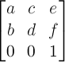

## CSSの拡張機能

### 名前空間

<div class="notice">

**バージョン4.0.0では`@namespace`は解釈しません。**宣言は読み飛ばし、
接頭辞つきの選択子は一致しません。名前空間を区別せず要素名だけで
スタイルを当ててください。以下はバージョン3系での説明です。

</div>

CSSの名前空間のための拡張機能[ (CSS Namespace Enhancements)](https://www.w3.org/TR/css3-namespace/) をサポートしており、複数の名前空間が混在するXMLをスタイル付けすることができます。

CSSスタイルシート中で名前空間の接頭辞(prefix)とURIを指定するためには、
@namespace指示子を使って以下のように宣言してください。

```css
/* デフォルトの名前空間のURIをhttp://www.w3.org/1999/xhtmlとする。 */
@namespace "http://www.w3.org/1999/xhtml";

/* 接頭辞rdfのURIをhttp://www.w3.org/1999/02/22-rdf-syntax-ns#とする。 */
@namespace rdf "http://www.w3.org/1999/02/22-rdf-syntax-ns#";
```

なお、互換性のためにURIの部分はurl(http://www.w3.org/1999/xhtml)という書き方も許されています。

スタイルシートの選択子(selector)で接頭辞を使う場合は、'|'で区切ります。 (':'でないことに注意してください。)

```css
/* <pdf:Description>要素のスタイルを指定する。 */
rdf|Description { display: block; }

/* ref:about属性がhttp://foo.com/barであるitem要素のスタイルを指定する。 */
item[rdf|about=http://foo.com/bar] { color: Red; }
```

選択子の記述方法と、意味は次のとおりです。

<dl>

<dt>prefix|ELEMENT</dt>
<dd>prefixが指す名前空間に属するELEMENT</dd>
<dt>|ELEMENT</dt>
<dd>どの名前空間にも属さないELEMENT</dd>
<dt>*|ELEMENT</dt>
<dd>任意の名前空間にも属すか、どの名前空間にも属さないELEMENT</dd>
<dt>ELEMENT</dt>
<dd>デフォルトの名前空間に属するELEMENT</dd>

</dl>

### <a id="style-page-counter">ページカウンタ</a>

ページの番号付けのために、ページの生成ごとに処理されるページカウンタがあります。
ページカウンタは、以下のように@pageルール内の <span class="cssprop">counter-increment</span>
プロパティにより宣言します。

```css
@page {
	counter-increment: page;
}
```

ページカウンタの処理は、ページの内容が処理される直前に行われます。 また、ページカウンタは通常のカウンタと同様に、<span class="cssprop">content</span> プロパティ内でcounter関数により参照可能です。
従って、上記の宣言を行った場合、最初のページで <span class="cssdecl">content: counter(page);</span> という宣言が処理されるとき、1が出力されます。

途中でページカウンタをリセットする場合 (例えば、目次が終わった後、本文で改めて番号を振りなおすなど) は、通常のカウンタと同様に<span class="cssprop">counter-reset</span> を使うことができます。
例えば、ある要素が表示されるページでpageという名前のカウンタを1に設定しなおす場合は、その要素で <span class="cssdecl">counter-reset: page 1;</span> と宣言します。

### <a id="style-list-style-type">箇条書きと番号の形式</a>

<span class="cssprop">list-style-type</span>と`counter()`の2つめの引数に、
次の形式を指定できます。

| 分類 | 値 |
| --- | --- |
| 記号 | disc square circle none |
| 算用数字 | decimal decimal-leading-zero |
| 英字 | lower-alpha lower-latin upper-alpha upper-latin |
| ローマ数字 | lower-roman upper-roman |
| ギリシャ文字 | lower-greek |
| その他の文字体系 | armenian georgian hebrew(いずれも算用数字で表示します) |
| 日本語・中国語 | hiragana hiragana-iroha katakana katakana-iroha cjk-ideographic |
| 独自拡張 | -cssj-cjk-decimal -cssj-full-width-decimal |

`hiragana`は「あ い う…」、`hiragana-iroha`は「い ろ は…」の順です。
カタカナも同様です。`cjk-ideographic`は「一 二 三…」の漢数字で、
位取りをする漢数字は独自拡張の[-cssj-cjk-decimal](#style-cjk-decimal)を
使用してください。

### <a id="style-counter-style">独自の番号形式(@counter-style)<span class="since">4.0.0</span></a>

組み込みの形式に無い記号や並べ方は、`@counter-style`規則で定義できます。
定義した名前は<span class="cssprop">list-style-type</span>と
`counter()`・`counters()`・`target-counter()`の引数で使えます。

```css
@counter-style maru {
  system: fixed;              /* 記号を順に使い、尽きたら decimal へ */
  symbols: "①" "②" "③" "④" "⑤";
  suffix: " ";
}
@counter-style kakko-kansuji {
  system: extends cjk-ideographic;  /* 組み込みを基に後ろだけ変える */
  prefix: "(";
  suffix: ") ";
}
ol.maru { list-style-type: maru; }
ol.kansuji { list-style-type: kakko-kansuji; }
```

`system`には次を指定できます。

| system | 並べ方 |
| --- | --- |
| `cyclic` | 記号を先頭から繰り返し使います |
| `fixed` `fixed 開始値` | 記号を1つずつ使い、尽きたら`fallback`へ移ります |
| `symbolic` | 記号を使い切るたびに、同じ記号を重ねます(*、**、***) |
| `alphabetic` | 英字のように桁上がりします(a、b、…、aa) |
| `numeric` | 位取り記数法です。最初の記号が0になります |
| `additive` | ローマ数字のように、重みの大きい記号から足していきます |
| `extends 名前` | 既存の形式を引き継ぎ、指定した記述子だけを変えます |

記述子は`symbols`・`additive-symbols`・`prefix`・`suffix`・`negative`
(負の数の前後)・`range`(使う範囲)・`pad`(桁揃え)・`fallback`
(表せないときに使う形式)です。定義していない名前を指定した場合や、
その形式で表せない数の場合は`decimal`(算用数字)になります。

<div class="note">

`prefix`と`suffix`は箇条書きのマーカーにだけ付きます。`counter()`で
番号を文字列として取り出す場合には付きません(CSSの仕様どおりです)。

音声用の`speak-as`と`symbols()`関数記法には対応していません。
`range`に複数の範囲を書いた場合は、最初の範囲だけを使います。

</div>

### <a id="style-cjk-decimal">全角数字と漢数字による箇条書き番号</a>

箇条書きの先頭に付けるマーカー文字の形式を拡張しています。 <span class="cssprop">list-style-type</span>
で、次のキーワードを利用可能です。

<dl>

<dt>-cssj-full-width-decimal<span class="since">3.0.0</span></dt>
<dd>マーカーに全角数字を使います。</dd>
<dt>-cssj-cjk-decimal<span class="since">3.0.0</span></dt>
<dd>マーカーに位取り漢数字を使います。</dd>
<dt>-cssj-decimal-full-width<span class="since">2.1.2</span></dt>
<dd>-cssj-full-width-decimalと同じです。</dd>

</dl>

```html
<html>
  <head>
    <style type="text/css">
    #a {
      list-style-type: -cssj-full-width-decimal;
    }
    #b {
      list-style-type: -cssj-cjk-decimal;
    }
    </style>
  </head>
  <body>
    <ol id="a">
      <li>田作り</li>
      <li>黒豆</li>
      <li>栗きんとん</li>
    </ol>
    <ol id="b">
      <li>かまぼこ</li>
      <li>伊達巻</li>
      <li>数の子</li>
    </ol>
  </body>
</html>
```

<div title="マーカーの形式（表示結果）" class="example">
	<ol style="list-style-type: -cssj-full-width-decimal;">
		<li>田作り</li>
		<li>黒豆</li>
		<li>栗きんとん</li>
	</ol>
	<ol style="list-style-type: -cssj-cjk-decimal;">
		<li>かまぼこ</li>
		<li>伊達巻</li>
		<li>数の子</li>
	</ol>
</div>

<span class="cssprop">content</span>のcounter関数でも同じキーワードを使うことができます。

```html
<html>
  <head>
    <style type="text/css">
    #a:before {
      counter-increment: a;
      content: counter(a, -cssj-full-width-decimal);
    }
    #b:after {
      counter-increment: b;
      content: counter(b, -cssj-cjk-decimal);
    }
    </style>
  </head>
  <body>
    <div id="a">田作り</div>
    <div id="a">黒豆</div>
    <div id="a">栗きんとん</div>
    <div id="b">かまぼこ</div>
    <div id="b">伊達巻</div>
    <div id="b">数の子</div>
  </body>
</html>
```

<div title="counterの形式（表示結果）" class="example">
	<div>１田作り</div>
	<div>２黒豆</div>
	<div>３栗きんとん</div>
	<div>かまぼこ一</div>
	<div>伊達巻二</div>
	<div>数の子三</div>
</div>

### <a id="style-no-break">禁則処理</a>

行頭禁則文字（直前での折り返しをしない文字）は、全角スペースと、JLREQの
終わり括弧類(cl-02)、ハイフン類(cl-03)、区切り約物(cl-04)、中点類(cl-05)、
句点類(cl-06)、読点類(cl-07)、繰返し記号(cl-09)、長音記号(cl-10)、
小書きの仮名(cl-11)です。主な約物は次のとおりです。

<pre style="border: 1pt solid Black;">’ ” ） 〕 ］ ｝ 〉 》 」 』 】 ⦆ 〙 〗 » 〟
‐ 〜 ゠ – ！ ？ ‼ ⁇ ⁈ ⁉ ・ ： ； 。 ． 、 ，</pre>

UnicodeのEND_PUNCTUATION（閉じ括弧類）、OTHER_PUNCTUATION（その他の括弧類）、
MODIFIER_LETTER（修飾文字）、MODIFIER_SYMBOL（修飾記号）も補助的に行頭禁則とします。
ただし、分離禁止文字(cl-08)の縦書き用くの字点は、この一律処理から除外します。

行末禁則文字（直後での折り返しをしない文字）は次の文字です。

<pre style="border: 1pt solid Black;">‘ “ （ 〔 ［ ｛ 〈 《 「 『 【 ⦅ 〘 〖 « 〝</pre>

これらはJLREQの始め括弧類(cl-01)を明示したものです。`‘`、`“`、`«`のように
UnicodeのSTART_PUNCTUATIONではない引用符も含みます。このほか
UnicodeのSTART_PUNCTUATION（開き括弧類）も補助的に行末禁則とします。

分離禁止文字(cl-08)の二倍ダーシ・二倍リーダと`〳〵`・`〴〵`は、
それぞれの対の途中では折り返しません。単独のダーシ・リーダと、くの字点の
先頭文字は行頭に置けます。`〵`を無関係な直前文字へ結合することはありません。

半角英数字の間でも折り返しが禁止されます。 ただし、半角スペースと、次の文字の間では折り返しされます。

<pre style="border: 1pt solid Black;">-!?</pre>

#### word-wrap<span class="since">3.0.0</span>

<span class="cssprop">word-wrap</span> はCSS Text Module Level 3 に沿った実装です。仕様は次のとおりです。

<dl>

<dt>値</dt>
<dd>normal | break-word</dd>
<dt>初期値</dt>
<dd>normal</dd>
<dt>適用対象</dt>
<dd>すべて</dd>
<dt>値の継承</dt>
<dd>する</dd>

</dl>

break-wordを設定すると、内容が行幅の限界をはみ出さないように、
必要に応じて禁則処理されている部分での折り返しをします。

```html
<html>
  <head>
    <style type="text/css">
    div {
      width: 6ex;
      border: 1pt solid Red;
    }
    #a {
      word-wrap: normal;
    }
    #b {
      word-wrap: break-word;
    }
    </style>
  </head>
  <body>
    <div id="a">Distance lends enchantment to the view.</div>
    <div id="b">Distance lends enchantment to the view.</div>
  </body>
</html>
```

<div title="word-wrapの使用例（表示結果）" class="example">
	<div style="width: 6ex; border: 1pt solid Red; word-wrap: normal;">Distance
		lends enchantment to the view.</div>
	<div style="width: 6ex; border: 1pt solid Red; word-wrap: break-word;">Distance
		lends enchantment to the view.</div>
</div>

禁則文字を新たに追加・除外するために、<span class="cssprop">-cssj-no-break-characters</span>,
<span class="cssprop">-cssj-break-characters</span>という独自CSSプロパティを用意しています。

#### -cssj-no-break-characters<span class="since">3.0.6</span>

<dl>

<dt>値</dt>
<dd>none | &lt;string&gt;{1,2}</dd>
<dt>初期値</dt>
<dd>none</dd>
<dt>適用対象</dt>
<dd>すべて</dd>
<dt>値の継承</dt>
<dd>する</dd>

</dl>

禁則文字を追加します。１つめの&lt;string&gt;は行頭禁則文字、２つめの&lt;string&gt;行末禁則文字を指定します。
&lt;string&gt;が１つだけの場合は行頭禁則文字だけが追加されます。

例えば、次の文章があるとします。

```html
<div style="border:1px solid; width: 7em;">
今日の相場は１＄がロンドンで９８円５５銭－先月と比べて２㌫上昇しました。
</div>
```

<div title="-cssj-no-break-characters適用前（表示結果）" class="example">
	<div style="border: 1px solid; width: 7em;">
		今日の相場は１＄がロンドンで９８円５５銭－先月と比べて２㌫上昇しました。</div>
</div>

'㌫'と'＄'を行頭に表示させたくなく、'－'を行末に表示させたくないという場合は、次のように指定してください。

```html
<div style="border:1px solid; width: 7em; -cssj-no-break-characters: '㌫＄' '－';">
今日の相場は１＄がロンドンで９８円５５銭－先月と比べて２㌫上昇しました。
</div>
```

<div title="-cssj-no-break-characters適用後（表示結果）" class="example">
	<div
		style="border: 1px solid; width: 7em; -cssj-no-break-characters: '㌫＄' '－';">
		今日の相場は１＄がロンドンで９８円５５銭－先月と比べて２㌫上昇しました。</div>
</div>

#### -cssj-break-characters<span class="since">3.0.6</span>

<dl>

<dt>値</dt>
<dd>none | &lt;string&gt;{1,2}</dd>
<dt>初期値</dt>
<dd>none</dd>
<dt>適用対象</dt>
<dd>すべて</dd>
<dt>値の継承</dt>
<dd>する</dd>

</dl>

禁則文字を除外します。１つめの&lt;string&gt;は行頭禁則文字、２つめの&lt;string&gt;行末禁則文字を指定します。
&lt;string&gt;が１つだけの場合は行頭禁則文字だけが除外されます。

例えば次のように、拗音が行頭に来ないように調整します。

```html
<div style="border:1px solid; width: 10em;">
「トロメライ、ロマチックシューマン作曲。」猫は口を拭いて済まして云いました。
</div>
```

<div title="-cssj-break-characters適用前（表示結果）" class="example">
	<div style="border: 1px solid; width: 10em;">
		「トロメライ、ロマチックシューマン作曲。」猫は口を拭いて済まして云いました。</div>
	<p>しかし、実際に書籍は拗音を行頭禁則しないことが多いため、それに従うには次のようにします。</p>
</div>

```html
<div style="border:1px solid; width: 10em; -cssj-break-characters: 'ァィゥェォッャュョヮヵヶぁぃぅぇぉっゃゅょゎゕゖㇰㇱㇲㇳㇴㇵㇶㇷㇸㇹㇺㇻㇼㇽㇾㇿ';">
「トロメライ、ロマチックシューマン作曲。」猫は口を拭いて済まして云いました。
</div>
```

<div title="-cssj-break-characters適用後（表示結果）" class="example">
	<div
		style="border: 1px solid; width: 10em; -cssj-break-characters: 'ァィゥェォッャュョヮヵヶぁぃぅぇぉっゃゅょゎゕゖㇰㇱㇲㇳㇴㇵㇶㇷㇸㇹㇺㇻㇼㇽㇾㇿ';">
		「トロメライ、ロマチックシューマン作曲。」猫は口を拭いて済まして云いました。</div>
</div>

### <a id="style-autospace">和文詰め<span class="since">4.0.0</span></a>

日本語組版の文字間調整を、CSS Text Module Level 4 のプロパティで制御できます。
実装はW3Cの[日本語組版処理の要件(JLREQ)](https://www.w3.org/International/jlreq/?lang=ja)
を参照していますが、JLREQは規範的な適合試験ではなく、こちらも
完全準拠を標榜しません。ここに記載したサブセットが実装範囲です。

<dl>
<dt><span class="cssprop">text-autospace</span></dt>
<dd>和文と欧文・数字の境界に四分アキを入れます。
	<b>既定値はnormal(アキを入れる)です。</b>
	旧バージョンの見た目に戻すには<span class="cssdecl">text-autospace: no-autospace;</span>を
	指定してください。</dd>
<dt><span class="cssprop">text-spacing-trim</span></dt>
<dd>連続する約物(括弧・句読点・中点類)の間を詰めます。cl-01/cl-02の
附属書収録字種を対象とし、スタイル指定の異なる
隣接インラインの境界も処理します。中点類は前を四分アキ相当、後ろをベタ相当とし、
均等割付でも後ろを伸ばしません。値はnormal、space-all、space-first、trim-start、
trim-both、autoです。既定のnormalは行中を詰めますが行頭の始め括弧は全角のまま、
trim-startは行頭を天付き、trim-bothは行頭と行末を詰めます。autoは高品質設定として
trim-both相当です。space-firstは初行・強制改行直後だけ行頭のアキを残し、
space-allは約物の詰めを無効にします。段落第1行の字下げ量は
<span class="cssprop">text-indent</span>で指定します。比例幅の約物には固定0.5emの
詰めを適用しません。</dd>
<dt><span class="cssprop">hanging-punctuation</span></dt>
<dd>none、first、allow-end、force-endを指定できます。firstは最初の整形行の
先頭約物、allow-endは通常位置に収まらない行末句読点、force-endは全ての
対象行末句読点をぶら下げます。firstと行末値は順不同で併用できます。</dd>
</dl>

行頭・行末禁則、対単位の分離禁止文字、横組・縦組の全角相当の始め括弧類の
天付きも組版処理に含まれます。比例幅の始め括弧は固定0.5emずらしません。

行がわずかに収まらない場合は、JLREQの順序で、欧文語間、行末約物、行末中点、
内部中点、括弧・読点、和欧間(四分から最小八分)を追い込みます。全容量でも
収まらなければ直前の合法な分割点へ送ります。均等割付の追出しも、欧文語間、
和欧間、その他の分離可能字間、最終均等配分の順です。
和文・全角約物・ルビ・割注を含まない純欧文行にはこのJLREQ段階を適用せず、
欧文組版どおり語間を伸ばします。

```css
/* 従来の(アキを入れない)組版に戻す */
body {
	text-autospace: no-autospace;
	text-spacing-trim: space-all;
}
```

#### 割注<span class="since">4.0.0</span>

<span class="cssdecl">-cssj-warichu: auto;</span>を指定したインライン要素は、
本文の半分の文字サイズによる2段の割注になります。横組では上下2段、縦組では
左右2列です。短い側は中央に揃え、段内と長い割注の断片境界では禁則を守ります。
長い割注は小さな断片として本文の複数行へ折り返せます。

```html
本文<span style="-cssj-warichu:auto">この部分を割注として二段に組む</span>本文
```

割注の中身は文字を対象とします。画像、インラインブロック、絶対配置は
割注の注釈文字として組みません。

#### 添え字・振分け<span class="since">4.0.0</span>

添え字と振分けは標準HTML/CSSで組めます。添え字の親文字群を
`inline-block`かつ`white-space: nowrap`にすると、内部で改行・均等割付されません。
字大は文書側で指定でき、JLREQが示す一般的な目安は親文字の約60%です。

振分けは`inline-table`の各行へ候補を置き、`vertical-align: middle`を指定します。
最長の候補が幅を決め、振分け全体は1個の行内要素として本文の複数行へ分裂しません。
この構造は横組と縦組のどちらにも使えます。

```css
.scripted { display: inline-block; white-space: nowrap; }
.scripted > sup, .scripted > sub { font-size: 60%; }
.furiwake { display: inline-table; vertical-align: middle;
             line-height: 1; white-space: nowrap; }
.furiwake-row { display: table-row; }
.furiwake-cell { display: table-cell; }
```

ルビと割注の注釈字面は本文の行高を押し広げず、基準行位置を維持して行間へ
描きます。衝突しない行間は`line-height`で確保してください。

#### 傍注・頭注<span class="since">4.0.0</span>

JLREQの並列注は、独自のfloat値で本文の論理行頭側または行末側へ置けます。
横組では傍注、縦組では頭注／脚注に相当する側になります。同じ側の注は
本文位置に近い順で配置し、互いに重ねません。

```css
@page { margin-inline: 48pt; }
.note-start { float: -cssj-note-start; inline-size: 36pt; }
.note-end   { float: -cssj-note-end;   inline-size: 36pt; }
```

注領域は本文と重ならないよう、`@page`の余白と注自身の行方向寸法を指定して
確保してください。並列注に対応する標準CSS構文がないため、この2値は
独自拡張です。

### <a id="style-line-breaking">行分割の品質<span class="since">4.0.0</span></a>

行の分割方法を<span class="cssprop">text-wrap-style</span>プロパティ
(短縮形は<span class="cssprop">text-wrap</span>)で選べます。

<dl>

<dt>auto</dt>
<dd>初期値です。1行ずつ、詰められるだけ詰めていきます。
	一般的なブラウザと同じ方法で、処理は高速です。</dd>
<dt>pretty</dt>
<dd>段落全体で最適な分割を探します(Knuth-Plassのアルゴリズム)。
	行の詰まり具合が揃い、ハイフンで終わる行が連続しにくくなります。
	そのぶん処理に時間がかかります。</dd>

</dl>

### <a id="style-text-justify">両端揃えの配分<span class="since">4.0.0</span></a>

<span class="cssdecl">text-align: justify</span>で行の余りをどこへ配るかを
<span class="cssprop">text-justify</span>プロパティで選べます。

<dl>

<dt>auto</dt>
<dd>初期値です。言語で決めます。日本語の行はJLREQの段階的な配分
	(欧文の語間→和欧間→文字間)、韓国語(<tt>lang="ko"</tt>)は<b>語間だけ</b>
	——ブラウザと同じで、音節の送りは動きません——、それ以外は従来どおり
	分離できる境界へ均等に配ります。</dd>
<dt>inter-word</dt>
<dd>語間(空白)だけを伸ばします。語間の無い行は動かしません。</dd>
<dt>inter-character</dt>
<dd>文字間にも配ります(<tt>distribute</tt>も同じ)。</dd>
<dt>none</dt>
<dd>両端揃えをしません。</dd>

</dl>

```css
p {
	text-wrap: pretty;
}
```

<div class="note">

`balance`と`stable`は、書いてもエラーにはなりませんが`auto`として扱います。

`pretty`が効くのは**段落を作るブロック**に指定した場合だけです。
インライン要素や`::first-line`に指定しても分割方法は変わりません。

次の段落は`pretty`を指定しても`auto`で処理します。
縦書き、`white-space`が`pre`または`pre-wrap`、
<span class="cssprop">-cssj-word-wrap</span>が`break-word`、
ルビ・インラインの置換要素・インラインブロック・インラインの絶対配置を含む、
タブを含む、和欧間の`text-autospace`が実際に発生する、段落内に浮動ボックスがある、
`::first-line`がある場合です。

</div>

### <a id="style-hyphens">ハイフネーション<span class="since">4.0.0</span></a>

欧文の単語をハイフンで分割するかどうかを
<span class="cssprop">hyphens</span>プロパティで指定します。

<dl>

<dt>manual</dt>
<dd>初期値です。文書中の分割可能位置(`&amp;shy;`)でだけ分割します。</dd>
<dt>auto</dt>
<dd>辞書に基づいて自動的に分割します。</dd>
<dt>none</dt>
<dd>分割しません。</dd>

</dl>

```css
p {
	hyphens: auto;
}
```

<div class="note">

`hyphens: auto`が働くのは、<tt>lang</tt>属性が`en`(英語)の範囲だけです。
他の言語では`manual`と同じ動作になります。

</div>

### <a id="style-word-wrap">長い単語の途中での折り返し</a>

<span class="cssprop">word-wrap</span>に`break-word`を指定すると、
行に収まらない長い単語を途中で折り返します。初期値は`normal`で、
折り返さずにはみ出します。

### <a id="style-text-emphasis">圏点<span class="since">3.0.4</span></a>

主に日本語の文章の一部を強調するために使われる、圏点を打つことができます。
新しく書く文書ではCSS Text Decoration Module Level 3の標準名
<span class="cssprop">text-emphasis-style</span>、
<span class="cssprop">text-emphasis-color</span>、
<span class="cssprop">text-emphasis</span>を使ってください。

従来の<span class="cssprop">-cssj-</span>接頭辞と、EPUB互換の
<span class="cssprop">-epub-</span>接頭辞も同じ意味の別名として使えます。

圏点の記号は本文のフォントを使って表示されます。 より美しい圏点を出力するためには [Kenten Generic OpenType Font](https://github.com/adobe-fonts/kenten-generic)
を埋め込みフォントとして使用することを推奨します。 本文のフォントファミリを <span class="cssdecl">font-family: 'Kenten Generic' 本文フォント...;</span> のように指定してください。

#### text-emphasis-style

<dl>

<dt>値</dt>
<dd>none | [ [ filled | open ] || [ dot | circle | double-circle | triangle | sesame ] ] | &lt;string&gt;</dd>
<dt>初期値</dt>
<dd>none</dd>
<dt>適用対象</dt>
<dd>すべて</dd>
<dt>値の継承</dt>
<dd>する</dd>

</dl>

noneが設定された場合、圏点を打ちません。

その他の値が設定された場合、圏点の種類（ユニコード 文字）はそれぞれ次のとおりになります。

<dl>

<dt>filled dot</dt>
<dd>U+2022 ‘•’</dd>
<dt>open dot</dt>
<dd>U+25E6 ‘◦’</dd>
<dt>filled circle</dt>
<dd>U+25CF ‘●’</dd>
<dt>open circle</dt>
<dd>U+25CB ‘○’</dd>
<dt>filled double-circle</dt>
<dd>U+25C9 ‘◉’</dd>
<dt>open double-circle</dt>
<dd>U+25CE ‘◎’</dd>
<dt>filled triangle</dt>
<dd>U+25B2 ‘▲’</dd>
<dt>open triangle</dt>
<dd>U+25B3 ‘△’</dd>
<dt>filled sesame</dt>
<dd>
	U+FE45 <span class="for-screen">‘﹅’</span><span class="for-print">‘’
	</span>
</dd>
<dt>open sesame</dt>
<dd>
	U+FE46 <span class="for-screen">‘﹆’</span><span class="for-print">‘’
	</span>
</dd>

</dl>

filledかopenだけが指定された場合は、横書きではそれぞれ filled circle, open circle
が指定されるのと同じになり、縦書きではそれぞれ filled sesame, open sesame が指定されるのと同じになります。

文字列が指定された場合、文字列の最初の文字が圏点になります。

```html
<html>
  <head>
    <style type="text/css">
    #a {
      text-emphasis-style: filled;
    }
    #b {
      text-emphasis-style: open triangle;
    }
    #c {
      text-emphasis-style: '※';
    }
    </style>
  </head>
  <body>
<p><span id="a">ここ</span>に丸い圏点を打ちます</p>
<p><span id="b">ここ</span>に三角の圏点を打ちます</p>
<p><span id="c">ここ</span>に米印の圏点を打ちます</p>
  </body>
</html>
```

<div title="text-emphasis-styleの使用例（表示結果）" class="example">
	<p>
		<span style="text-emphasis-style: filled;">ここ</span>に丸い圏点を打ちます
	</p>
	<p>
		<span style="text-emphasis-style: open triangle;">ここ</span>に三角の圏点を打ちます
	</p>
	<p>
		<span style="text-emphasis-style: '※';">ここ</span>に米印の圏点を打ちます
	</p>
</div>

#### text-emphasis-color

<dl>

<dt>値</dt>
<dd>&lt;color&gt;</dd>
<dt>初期値</dt>
<dd>文字の色と同じ</dd>
<dt>適用対象</dt>
<dd>すべて</dd>
<dt>値の継承</dt>
<dd>する</dd>

</dl>

圏点の色を指定します。 色の指定方法は<span class="cssprop">color</span>プロパティなどの場合と同じです。

```html
<html>
  <head>
    <style type="text/css">
    span {
      text-emphasis-style: filled;
    }
    #a {
      text-emphasis-color: Red;
    }
    #b {
      color: Red;
    }
    </style>
  </head>
  <body>
<p><span id="a">この</span>圏点は赤いです</p>
<p><span id="b">この</span>圏点も文字も赤です</p>
  </body>
</html>
```

<div title="text-emphasis-colorの使用例（表示結果）" class="example">
	<p>
		<span style="text-emphasis-style: filled; text-emphasis-color: Red;">この</span>圏点は赤いです
	</p>
	<p>
		<span style="text-emphasis-style: filled; color: Red;">この</span>圏点も文字も赤です
	</p>
</div>

#### text-emphasis

<span class="cssprop">text-emphasis-style</span>, <span class="cssprop">text-emphasis-color</span> をまとめて指定するプロパティです。
圏点のスタイル、色の順に指定します。

```html
<html>
  <head>
    <style type="text/css">
    #a {
      text-emphasis: filled triangle Red;
    }
    #b {
      text-emphasis: '※' Pink;
    }
    </style>
  </head>
  <body>
<p><span id="a">この</span>圏点は赤い三角です</p>
<p><span id="b">この</span>圏点はピンクの米印です</p>
  </body>
</html>
```

<div title="text-emphasisの使用例（表示結果）" class="example">
	<p>
		<span style="text-emphasis: filled triangle Red;">この</span>圏点は赤い三角です
	</p>
	<p>
		<span style="text-emphasis: '※' Pink;">この</span>圏点はピンクの米印です
	</p>
</div>

### <a id="style-text-shadow">文字の影<span class="since">3.0.8</span></a>

一般的なブラウザがサポートしている「文字の影落とし」に対応しています。
影の「ぼかし」にも対応します<span class="since">4.0.0</span>。画像出力(PNG/JPEG)とSVG系の出力では
本物のガウスぼかしで描きます。PDF出力でも、影だけを画素にして透明度付きの画像として置くことで本物のぼかしになります<span class="since">4.0.0</span>(文字や本文はベクタのまま。解像度は<span class="ioprop">output.pdf.blur-resolution</span>)。透明を使えないPDF/A-1・PDF/Xでは12段の縁取りの重ね描きで近似し、警告2822で知らせます。

#### text-shadow

<dl>

<dt>値</dt>
<dd>none | [ &lt;length&gt;{2,3} &amp;&amp; &lt;color&gt;? ]#</dd>
<dt>初期値</dt>
<dd>none</dd>
<dt>適用対象</dt>
<dd>すべて</dd>
<dt>値の継承</dt>
<dd>する</dd>

</dl>

<span class="cssprop">text-shadow</span>の値は、影のx方向の位置、y方向の位置、ぼかしの半径(省略可)、影の色の順に指定します。
また、カンマで区切ることにより、複数の影を落とすことができます。 １つ目の影は文字の後ろに作られ、順に背面へと作られます。

影は文字そのものではなく<b>字形の輪郭</b>として描くので<span class="since">4.0.0</span>、PDFから文字列を取り出したときに影のぶんが重複することはありません。ただし字形のデータが手元に無いフォント(埋め込まないCIDフォントや、PDFが標準で備える14書体)では輪郭にできず、影も文字として出力されます。PDFから取り出す文字列をきれいに保ちたい場合は、<span class="ioprop">output.pdf.fonts.policy</span>の先頭に<tt>embedded</tt>を指定してフォントを埋め込んでください。

```html
<html>
  <head>
    <style type="text/css">
    * {
      font-size: 32pt;
    }
    #a {
      text-shadow: 4pt 8pt Gray;
    }
    #b {
      text-shadow: 8pt 8pt Gray, 16pt 16pt LightGray;
    }
    </style>
  </head>
  <body>
<p id="a">灰色の影のある文字</p>
<p id="b">灰色の影の後ろにさらに薄い灰色の影</p>
  </body>
</html>
```

<div title="text-shadowの使用例（表示結果）" class="example">
	<p style="font-size: 32pt; text-shadow: 4pt 8pt Gray;">灰色の影のある文字</p>
	<p style="font-size: 32pt; text-shadow: 8pt 8pt Gray, 16pt 16pt LightGray;">灰色の影の後ろにさらに薄い灰色の影</p>
</div>

### <a id="style-text-stroke">袋文字<span class="since">3.0.8</span></a>

レンダリングエンジンとしてWebKitを利用しているブラウザ（Google Chrome, Safari等）との互換性のために、テキストの輪郭と塗りを別々に指定するプロパティを用意しています。
これは袋文字の効果を実現するために使うことができます。

<span class="cssprop">-cssj-text-fill-color</span>,
<span class="cssprop">-cssj-text-stroke-width</span>,
<span class="cssprop">-cssj-text-stroke-color</span>,
<span class="cssprop">-cssj-text-stroke</span>
という４つの独自プロパティを用意しています。これらは、WebKitとの互換性のために、それぞれ
<span class="cssprop">-webkit-text-fill-color</span>,
<span class="cssprop">-webkit-text-stroke-width</span>,
<span class="cssprop">-webkit-text-stroke-color</span>,
<span class="cssprop">-webkit-text-stroke</span>
というプロパティ名でも利用することができます。

輪郭は既定では塗りの上に描かれるため、太い輪郭では字が痩せます。
SVGと同じ<span class="cssprop">paint-order</span>プロパティに
<tt>stroke fill</tt>を指定すると、輪郭を先に描いてから塗りを重ねるので、
字面の太さを保ったまま外側にだけ縁が付きます<span class="since">4.0.0</span>。
挿絵の上に置く題字の白い縁取りなどに使えます。

```css
h1.title {
	-cssj-text-stroke: 2pt white;
	paint-order: stroke fill;
}
```

#### -cssj-text-fill-color

<dl>

<dt>値</dt>
<dd>&lt;color&gt; | currentcolor</dd>
<dt>初期値</dt>
<dd>currentcolor</dd>
<dt>適用対象</dt>
<dd>すべて</dd>
<dt>値の継承</dt>
<dd>する</dd>

</dl>

テキストの塗りつぶし色を設定します。
なにも指定しない場合は、<span class="cssprop">color</span>による指定と同じになります。

#### -cssj-text-stroke-width

<dl>

<dt>値</dt>
<dd>&lt;width&gt; | medium | thick | thin</dd>
<dt>初期値</dt>
<dd>0</dd>
<dt>適用対象</dt>
<dd>すべて</dd>
<dt>値の継承</dt>
<dd>する</dd>

</dl>

テキストの枠の幅をしていします。
0以外の値を設定すると、枠が描画されるようになります。

#### -cssj-text-stroke-color

<dl>

<dt>値</dt>
<dd>&lt;color&gt; | currentcolor</dd>
<dt>初期値</dt>
<dd>currentcolor</dd>
<dt>適用対象</dt>
<dd>すべて</dd>
<dt>値の継承</dt>
<dd>する</dd>

</dl>

テキストの枠の色を設定します。
なにも指定しない場合は、<span class="cssprop">color</span>による指定と同じになります。

#### -cssj-text-stroke

<dl>

<dt>値</dt>
<dd>&lt;width&gt; &lt;color&gt;</dd>
<dt>初期値</dt>
<dd>none</dd>
<dt>適用対象</dt>
<dd>すべて</dd>
<dt>値の継承</dt>
<dd>する</dd>

</dl>

テキストの枠の幅と色を一度に設定します。

```html
<html>
  <head>
    <style type="text/css">
    * {
      font-size: 32pt;
    }
    #a {
      -cssj-text-stroke-width: 2pt;
    }
    #b {
      -cssj-text-stroke: 1pt Black;
      -cssj-text-fill-color: White;
    }
    </style>
  </head>
  <body>
<p id="a">輪郭を太らせた文字</p>
<p>テキストの<span id="b">この部分</span>が白抜き</p>
  </body>
</html>
```

<div title="袋文字（表示結果）" class="example">
<p style="font-size: 32pt; -cssj-text-stroke-width: 2pt;">輪郭を太らせた文字</p>
<p style="font-size: 32pt;">文章の<span style="-cssj-text-stroke: 1pt Black; -cssj-text-fill-color: White;">この部分</span>が白抜き</p>
</div>

### <a id="style-opacity">透明化<span class="since">3.0.6</span></a>

#### opacity

<dl>

<dt>値</dt>
<dd>&lt;alphavalue&gt;</dd>
<dt>初期値</dt>
<dd>1</dd>
<dt>適用対象</dt>
<dd>すべて</dd>
<dt>値の継承</dt>
<dd>しない</dd>

</dl>

要素の不透明度を設定します。値は0(透明)から1(不透明)までの小数値です。
例えば0.5に設定すると、その要素は50%の透明度を持つことになります。

```html
<html>
  <head>
    <style type="text/css">
    * {
      font-size: 32pt;
    }
    #a {
      position: relative;
      top: -32pt;
      font-size: 32pt;
      border: 5pt solid Red;
      background-color: Yellow;
      opacity: 0.7;
    }
    </style>
  </head>
  <body>
<div>輪郭を太らせた文字</div>
<div id="a">透明化したボックス</div>
  </body>
</html>
```

<div title="opacityの使用例（表示結果）" class="example">
<div style="font-size: 32pt;">背景にある文字</div>
<div style="position: relative; top: -32pt; font-size: 32pt; border: 5pt solid Red; background-color: Yellow; opacity: .7;">半透明化したボックス</div>
</div>

### <a id="style-alpha">透明色<span class="since">3.0.8</span></a>

前記の<span class="cssprop">opacity</span>は要素全体を半透明にするものでしたが、これとは別に、rgba関数により各指定色に透明度を加えることができます。
これにより、例えば文字、境界線に別々の透明度を指定することができます。
rgba関数は色指定をする<span class="cssprop">color</span>, <span class="cssprop">background-color</span>, <span class="cssprop">border-color</span>
等のプロパティで使用することができます。
rgba関数内の数値は、それぞれ赤、緑、青、不透明度の順です。不透明度は0から1までの小数で指定します。

```html
<html>
  <head>
    <style type="text/css">
    * {
      font-size: 32pt;
    }
    #a {
      position: relative;
      top: -32pt;
      font-size: 32pt;
      border: 5pt solid Red;
      background-color: rgba(255,255,0,0.5);
    }
    </style>
  </head>
  <body>
<div>輪郭を太らせた文字</div>
<div id="a">透明化したボックス</div>
  </body>
</html>
```

<div title="rgbaの使用例（表示結果）" class="example">
<div style="font-size: 32pt;">背景にある文字</div>
<div style="position: relative; top: -32pt; font-size: 32pt; border: 5pt solid Red; background-color: rgba(255,255,0,0.5);">背景だけが半透明</div>
</div>

### <a id="style-color-functions">新しい色の指定<span class="since">4.0.0</span></a>

`rgb()`・`rgba()`のほかに、次の色関数を使えます。近年のWeb向け
スタイルシート(CSSフレームワークの既定色など)で広く使われています。

| 関数 | 意味 |
| --- | --- |
| `hsl()` `hsla()` | 色相・彩度・明度で指定します |
| `oklch()` | 明度・彩度・色相で指定します(人の見た目に沿った色空間) |
| `oklab()` | 同じ色空間を直交座標で指定します |
| `color-mix()` | 2色を混ぜます。`in srgb` `in oklab` `in oklch`が使えます |
| `light-dark()` | 明るい配色と暗い配色を書き分けます |

```css
.a { color: oklch(0.63 0.26 29); }            /* 赤 */
.b { background-color: hsl(210 80% 50% / 0.5); }
.c { border-color: color-mix(in oklab, Blue 30%, White); }
.d { color: light-dark(Black, White); }
```

<div class="note">

色は最終的にsRGBへ変換して保持します。sRGBの範囲を超える色は
範囲内へ丸められます。

`light-dark()`は**常に1つめ(明るい配色向け)の色**になります。
紙面には明暗の切り替えがないためです。

`lab()`・`lch()`・`hwb()`・`color()`関数<span class="since">4.0.0</span>にも対応しています。
`color()`では`srgb`・`srgb-linear`・`display-p3`・`a98-rgb`・`prophoto-rgb`・
`rec2020`・`xyz`・`xyz-d50`・`xyz-d65`の色空間を指定できます。
いずれもsRGBへ変換し、sRGBの色域を超える色は各成分を0〜1へ丸めます。

既存の色から作る相対色構文(`rgb(from ...)`のような書き方)には対応していません。

</div>

### <a id="style-border-radius">角丸境界<span class="since">3.0.6</span></a>

ボックスの境界線の四隅を丸くすることができます。

背景の四隅も丸くなります。
また、既知の問題として、４つの境界線の色・太さ・スタイル・角の半径が異なる場合、背景が境界をはみ出すことがあります。

角の半径を指定するために、`border-*-*-radius`という形式の４つのプロパティを使います。
これらのプロパティは１つまたは２つの長さ、％値を指定し、１つの場合は角の半径、２つの場合は角を楕円形の弧としそれぞれ左右方向と上下方向の半径となります。

#### border-top-left-radius

<dl>

<dt>値</dt>
<dd>[ &lt;length&gt; | &lt;percentage&gt; ]{1,2}</dd>
<dt>初期値</dt>
<dd>0</dd>
<dt>適用対象</dt>
<dd>すべて</dd>
<dt>値の継承</dt>
<dd>しない</dd>

</dl>

#### border-top-right-radius

<dl>

<dt>値</dt>
<dd>[ &lt;length&gt; | &lt;percentage&gt; ]{1,2}</dd>
<dt>初期値</dt>
<dd>0</dd>
<dt>適用対象</dt>
<dd>すべて</dd>
<dt>値の継承</dt>
<dd>しない</dd>

</dl>

#### border-bottom-left-radius

<dl>

<dt>値</dt>
<dd>[ &lt;length&gt; | &lt;percentage&gt; ]{1,2}</dd>
<dt>初期値</dt>
<dd>0</dd>
<dt>適用対象</dt>
<dd>すべて</dd>
<dt>値の継承</dt>
<dd>しない</dd>

</dl>

#### border-bottom-right-radius

<dl>

<dt>値</dt>
<dd>[ &lt;length&gt; | &lt;percentage&gt; ]{1,2}</dd>
<dt>初期値</dt>
<dd>0</dd>
<dt>適用対象</dt>
<dd>すべて</dd>
<dt>値の継承</dt>
<dd>しない</dd>

</dl>

<span class="cssprop">border-radius</span>は前記のプロパティをまとめて指定するためのものです。
値はそれぞれ、
<span class="cssprop">border-top-left-radius</span>,
<span class="cssprop">border-top-right-radius</span>,
<span class="cssprop">border-bottom-right-radius</span>,
<span class="cssprop">border-bottom-left-radius</span>
の順に指定します。
４番目の値が省略された場合、<span class="cssprop">border-bottom-left-radius</span>は
<span class="cssprop">border-top-right-radius</span>と同じになります。
３番目の値が省略された場合、<span class="cssprop">border-bottom-right-radius</span>は
<span class="cssprop">border-top-left-radius</span>と同じになります。
２番めの値が省略された場合、全ての隅が同じ指定になります。

左右方向と上下方向の半径は'/'(スラッシュ)記号で区切り、それぞれをまとめて指定します。

#### border-radius

<dl>

<dt>値</dt>
<dd>[ &lt;length&gt; | &lt;percentage&gt; ]{1,4} [ / [ &lt;length&gt; | &lt;percentage&gt; ]{1,4} ]?</dd>
<dt>適用対象</dt>
<dd>すべて</dd>
<dt>値の継承</dt>
<dd>しない</dd>

</dl>

```html
<html>
  <head>
    <style type="text/css">
    div {
      border: 1pt solid Red;
      background-color: Yellow;
      height: 50pt;
    }
    #a {
      border-radius: 5pt;
    }
    #b {
      border-radius: 10pt 20pt / 20pt 10pt;
      border-top-left-radius: 30pt;
    }
    </style>
  </head>
  <body>
<div id="a">四隅が丸いボックス</div>
<div id="b">四隅がいびつなボックス</div>
  </body>
</html>
```

<div title="角丸境界（表示結果）" class="example">
<div style="border-radius: 5pt; height: 50pt;border: 1pt solid Red; background-color: Yellow;">四隅が丸いボックス</div>
<div style="border-radius: 10pt 20pt / 20pt 10pt; border-top-left-radius: 30pt; height: 50pt; border: 1pt solid Red; background-color: Yellow;">四隅がいびつなボックス</div>
</div>

### <a id="style-transform">回転・拡大・変形<span class="since">3.0.8</span></a>

ボックスに対して二次元変換により回転、拡大、変形などを行うことができます。
なお、三次元変換には対応していません。

標準の<span class="cssprop">transform</span>,
<span class="cssprop">transform-origin</span>で指定してください。
互換のために<span class="cssprop">-cssj-transform</span>,
<span class="cssprop">-webkit-transform</span>,
<span class="cssprop">-moz-transform</span>(および対応する
<span class="cssprop">*-transform-origin</span>)も受け付けます。

#### transform

<dl>

<dt>値</dt>
<dd>none | &lt;transform-function&gt; [ &lt;transform-function&gt; ]*</dd>
<dt>初期値</dt>
<dd>none</dd>
<dt>適用対象</dt>
<dd>ブロックレベル要素</dd>
<dt>値の継承</dt>
<dd>しない</dd>

</dl>

ボックスに対する変換行列を指定します。
値には、noneまたは複数の変換関数を指定することができます。
利用できる変換関数は次のとおりです。

<dl>

<dt>matrix(a,b,c,d,e,f)</dt>
<dd>変換行列を直接指定します。</dd>

</dl>

変換行列は次のとおりに指定されます。

<div></div>

aは左右方向の拡大率、bは上下方向の傾斜率、cは左右方向の傾斜率、dは上下方向の拡大率、eは左右方向の移動距離、fは上下方向の移動距離に対応します。
e, fにはpt, em等の長さの単位を使用することができます。単位がない場合はpt単位です。なお、％値による指定には対応していません。

<dl>

<dt>translate(x, y)</dt>
<dd>左右方向と上下方向の移動距離を指定します。
yを省略した場合は、左右方向のみが指定されます。
長さの単位を使用することができます。単位がない場合はpt単位です。
</dd>

</dl>

<dl>

<dt>translateX(x)</dt>
<dd>左右方向の移動距離を指定します。
長さの単位を使用することができます。単位がない場合はpt単位です。</dd>

</dl>

<dl>

<dt>translateY(y)</dt>
<dd>上下方向の移動距離を指定します。
長さの単位を使用することができます。単位がない場合はpt単位です。</dd>

</dl>

<dl>

<dt>scale(x, y)</dt>
<dd>左右方向と上下方向の拡大率を指定します。</dd>

</dl>

<dl>

<dt>scaleX(x)</dt>
<dd>左右方向の拡大率を指定します。</dd>

</dl>

<dl>

<dt>scaleY(y)</dt>
<dd>上下方向の拡大率を指定します。</dd>

</dl>

<dl>

<dt>rotate(theta)</dt>
<dd>回転させます。thetaは角度で、degを付けると度単位、単位を省略するとラジアン単位となります。</dd>

</dl>

<dl>

<dt>skew(xtheta, ytheta)</dt>
<dd>左右方向と上下方向の傾斜角度を指定します。
それぞれの値は角度で、degを付けると度単位、単位を省略するとラジアン単位となります。</dd>

</dl>

<dl>

<dt>skewX(xtheta)</dt>
<dd>左右方向の傾斜角度を指定します。
xthetaは角度で、degを付けると度単位、単位を省略するとラジアン単位となります。</dd>

</dl>

<dl>

<dt>skewY(ytheta)</dt>
<dd>上下方向の傾斜角度を指定します。
ythetaは角度で、degを付けると度単位、単位を省略するとラジアン単位となります。</dd>

</dl>

#### transform-origin

<dl>

<dt>値</dt>
<dd>&lt;position&gt; [ , &lt;position&gt; ]*</dd>
<dt>初期値</dt>
<dd>50% 50%</dd>
<dt>適用対象</dt>
<dd>ブロックレベル要素</dd>
<dt>値の継承</dt>
<dd>しない</dd>

</dl>

変換の中央点を指定します。
デフォルトではボックスの中心になっており、例えばrotate関数を使用するとボックスの中心を回転の中心とします。

```html
<html>
  <head>
    <style type="text/css">
    body {
      margin: 40pt;
    }
    div {
      font-size: 32pt;
      position: absolute;
      transform-origin: 5pt 5pt;
    }
    #a {
      transform: rotate(0deg);
    }
    #b {
      transform: rotate(90deg);
    }
    #c {
      transform: rotate(180deg);
    }
    #d {
      transform: rotate(270deg);
    }
    </style>
  </head>
  <body>
<div id="a">▼</div>
<div id="b">▼</div>
<div id="c">▼</div>
<div id="d">▼</div>
  </body>
</html>
```

<div title="transform, transform-originの使用例（表示結果）" class="example">
<div style="margin: 40pt">
<div style="font-size: 32pt; position: absolute; transform-origin: 0 0;">▼</div>
<div style="font-size: 32pt; position: absolute; transform-origin: 0 0;transform: rotate(90deg);">▼</div>
<div style="font-size: 32pt; position: absolute; transform-origin: 0 0;transform: rotate(180deg);">▼</div>
<div style="font-size: 32pt; position: absolute; transform-origin: 0 0;transform: rotate(270deg);">▼</div>
</div>
</div>
