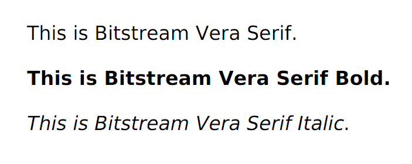

## <a id="style-webfont">WebFont</a>

WebFontを利用できます。
WebFontは、CSSによりファイルシステム上やネットワーク上のフォントを指定し、 文書をレイアウトする際に読み込むものです。
Internet Explorer, Safari, Chrome, Firefox等の最新のブラウザはWebFontをサポートしており、
これらのブラウザ向けに、表示環境に関わらず同じフォントが表示されるようにした文書は、
同じフォントを表示することができます。

WebFontは非常に手軽に使える反面、文書のレイアウトの度にフォントファイルを読み込むため、処理速度が遅くなります。
WebFontの利用は開発時や、どうしても使用する必要がある場合にとどめ、 可能な限り<b>システムのフォント設定</b>(pdfg2d の説明書)で対応することを推奨します。

### @font-face ルール

文書からフォントファイルを読み込むにはCSSの@font-faceルールを使います。 以下は、欧文フォントを読み込む例です。

```xml
<html>
<head>
  <style type="text/css">
    @font-face {
      font-family: "VeraSerif";
      src: url("http://dl.cssj.jp/docs/copper/misc/bitstream-vera/Vera.ttf");
    }
    @font-face {
      font-family: "VeraSerif";
      font-weight: bold;
      src: url("http://dl.cssj.jp/docs/copper/misc/bitstream-vera/VeraBd.ttf");
    }
    @font-face {
      font-family: "VeraSerif";
      font-style: italic;
      src: url("http://dl.cssj.jp/docs/copper/misc/bitstream-vera/VeraIt.ttf");
    }
    body {
      font-family: "VeraSerif"
    }
    .bold {
      font-weight: bold;
    }
    .italic {
      font-style: italic;
    }
  </style>
</head>
<body>
  <p>This is Bitstream Vera Serif.</p>
  <p class="bold">This is Bitstream Vera Serif Bold.</p>
  <p class="italic">This is Bitstream Vera Serif Italic.</p>
</body>
</html>
```

<div class="figure" title="ネットワーク上のフォントの読み込み(表示結果)">
  
</div>

@font-face内では、 <span class="cssprop">font-family</span>, <span class="cssprop">font-style</span>, <span class="cssprop">font-weight</span>,
<span class="cssprop">unicode-range</span>, <span class="cssprop">src</span>
の各プロパティを設定することができます。 このうち、 <span class="cssprop">font-family</span>, <span class="cssprop">src</span>は必須です。

<span class="cssprop">font-family</span>, <span class="cssprop">font-style</span>,
<span class="cssprop">font-weight</span> は、読み込まれたフォントの属性となります。
文書中で適切なフォントが選択される際の手がかりとなります。 フォントを選択する方法については、 <a href="#admin-config-fonts-select" class="pageref">ドキュメント中でのフォントの利用</a>
をご参照ください。

#### font-family

フォントのファミリ名です。

#### font-style

フォントのスタイルです。 normal, italic, obliqueのいずれかです。 デフォルトはnormalです。

#### font-weight

フォントの太さです。 normal, bold または100から900までの100刻みの値です。 デフォルトはnormalです。

#### unicode-range

フォントが利用可能な文字コードの範囲です。
ここで指定されたコード範囲にあり、かつフォントファイルに定義されている文字が利用可能な文字となります。
デフォルトはU+0-10FFFFです。

記述例は次のとおりです。

<dl>
  <dt>unicode-range: U+A5;</dt>
  <dd>円記号（￥）の文字だけに適用します。</dd>
  <dt>unicode-range: U+0-7F;</dt>
  <dd>ASCII文字（文字コード0から127）だけに適用します。</dd>
  <dt>unicode-range: U+30??;</dt>
  <dd>ひらがな、カタカナ（文字コード16進数で3000番台）だけに適用します。</dd>
  <dt>unicode-range: U+A5, U+0-7F, U+30??;</dt>
  <dd>前記の3つのコード範囲を合わせたものです。</dd>
</dl>

#### src

フォントファイルの位置です。 記述例は次のとおりです。

<dl>
  <dt>src: url(fonts/IPAMincho.otf);</dt>
  <dd>fonts/IPAMincho.otfというパスにあるフォントファイルを読み込みます。</dd>
  <dt>src: local(ＭＳ明朝)</dt>
  <dd>組版が動作しているOSにインストールされたＭＳ明朝という名前のフォントを読み込みます。</dd>
  <dt>src: local(ＭＳ明朝), url(fonts/IPAMincho.otf)</dt>
  <dd>OSにインストールされたＭＳ明朝が利用可能であればそれを使い、
    なければfonts/IPAMincho.otfを読み込みます。</dd>
</dl>

対応しているフォントフォーマットは、TrueType, OTF, WOFF<span class="since">3.1.0</span>です。SVGフォント等はサポートしていません。

次の例は、漢字には[IPA Pゴシック](https://ipafont.ipa.go.jp/)、 ひらがなと英数字には[きろ字](http://ola.kironono.com/entry/fonts-kiloji) を使用します。

```xml
<html>
<head>
  <style type="text/css">
    @font-face {
      font-family: "MyFont";
      src: url("http://dl.cssj.jp/docs/copper/misc/ipagp.otf");
      unicode-range: U+4E00-9FFF;
    }
    @font-face {
      font-family: "MyFont";
      src: url("http://dl.cssj.jp/docs/copper/misc/kiloji.ttf");
      unicode-range: U+A5, U+0-7F, U+30??;
    }
    body {
      font-family: "MyFont";
    }
  </style>
</head>
<body>
  <p>目に青葉／山ほととぎす／初がつお</p>
</body>
</html>
```

<div class="figure" title="複数のフォントの併用(表示結果)">
  
</div>
