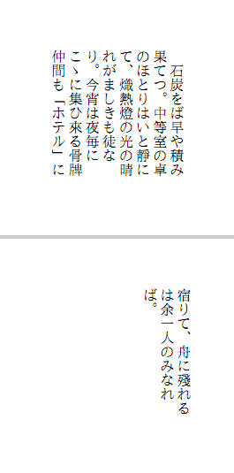
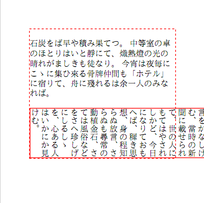
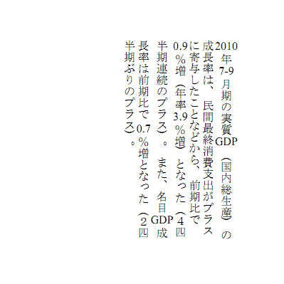
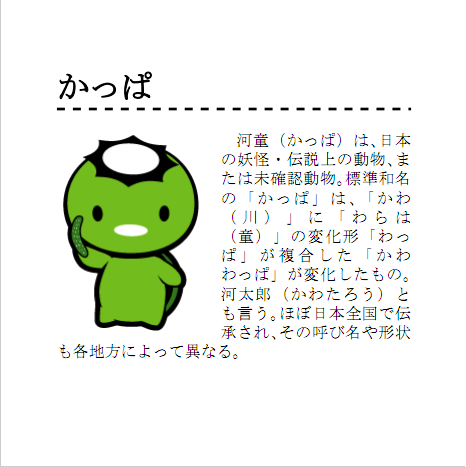
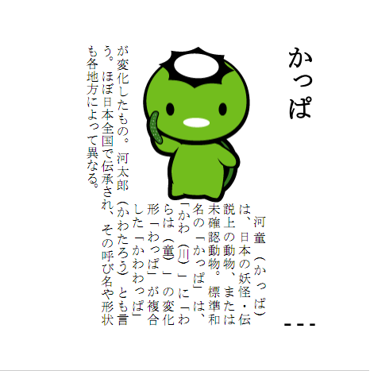
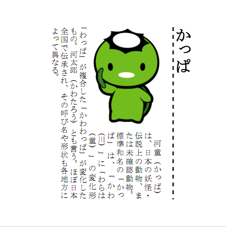

## <a id="style-vertical">縦書き</a>

CSS Writing Modes Level 3の`writing-mode`を使って縦書きを
サポートします<span class="since">3.0.0</span>。実装範囲はこの章に記載した
horizontal-tb、vertical-rl、vertical-lrと縦中横です。

### writing-mode

書字方向は CSS Writing Modes Level 3 の<span class="cssprop">writing-mode</span>で指定します。旧い名前(<span class="cssprop">-cssj-writing-mode</span>・<span class="cssprop">-epub-writing-mode</span>)でも指定できますが、**新しく書く文書では標準の名前を使ってください**。仕様は次のとおりです。

<dl>

<dt>値</dt>
<dd>horizontal-tb | vertical-rl | vertical-lr<span class="since">4.0.0</span> | lr | lr-tb | rl | rl-tb | tb | tb-rl | tb-lr</dd>
<dt>初期値</dt>
<dd>horizontal-tb</dd>
<dt>適用対象</dt>
<dd>テーブル行グループ、テーブルカラムグループ、テーブル行、テーブルカラム以外の要素</dd>
<dt>値の継承</dt>
<dd>する</dd>

</dl>

要素に対して horizontal-tbは横書き、vertical-rlは右から左へ行が進む縦書き(日本語の
一般的な縦書き)を適用します。vertical-lrは**左から右へ行が進む縦書き**です
<span class="since">4.0.0</span>。

SVG, Internet Explorerとの互換性のために用意されている、
lr, lr-tb, rlはhorizontal-tbと同じ意味であり、
同様にtb, tb-rlはvertical-rlと、rl-tb, tb-lrはvertical-lrと同じ意味です。

<div class="note">

vertical-lrは、日本語の縦書きではなく**回転させたラベル**に使います。
表の列見出しを回転して幅を稼ぐ、グラフの軸ラベル、背表紙、側面のタブなどです。
下から上へ向けて文字を並べるには、vertical-lrと
<span class="cssdecl">transform: rotate(180deg);</span>を組み合わせるのが定番です。

`text-orientation`はmixed(既定)、upright、sidewaysに対応します。mixedは
和文を正立し、欧文等を文字種に応じて横倒しにします。uprightは範囲内の文字を
全て正立、sidewaysは全て横倒しにします。短い数字等を1文字分へ収める場合は
`text-combine-upright: all`を使ってください。

```css
.mixed { text-orientation: mixed; }
.upright { text-orientation: upright; }
.sideways { text-orientation: sideways; }
.tcy { text-combine-upright: all; }
```

`writing-mode: sideways-rl / sideways-lr`には対応していません。文字の
位置による字形変化と接合を要する伝統モンゴル文字の組版も対象外です。

</div>

<span class="notice">テーブルセル(td, th)に<span class="cssprop">writing-mode</span>を指定することができますが、
	テーブルセルの書字方向を変えることは推奨しません。
	書字方向が変えられたテーブルセルの途中では常に改ページできなくなります。
	代わりに、テーブルセル内に<span class="cssprop">writing-mode</span>を設定したdivタグを入れ子にするなどしてください。
</span>

### 文書の書字方向

文書全体の書字方向は、文書のドキュメント要素（XMLではルート要素、HTMLでは、BODY要素）に対する、 <span class="cssprop">writing-mode</span>の指定によります。

文書全体の書字方向は、文書の綴じ方向に影響します。 すなわち、横書きでは左綴じ、縦書きでは右綴じとなります。 <span class="cssprop">page-break-before</span>, <span class="cssprop">page-break-after</span>
に対するleft, rightによる強制改ページでは、綴じ方向が考慮されます。

横書きの場合は、内容が下にはみ出したところから改ページされますが、 縦書きでは内容が左にはみ出したところから改ページされます。

日本語の縦書き、特に段組みでは、段落の孤立行を制御する<span class="cssprop">orphans</span>と<span class="cssprop">widows</span>に1を指定すると、ページ末や段末の不自然な空きを避けやすくなります。詳しくは<a href="#style-pagebreak-widows-orphans" class="pageref">orphansとwidows</a>を参照してください。

```html
<html>
<head>
  <style type="text/css">
    body {
      writing-mode: vertical-rl;
    }
  </style>
</head>
<body>
<p>
石炭をば早や積み果てつ。
中等室の卓のほとりはいと靜にて、熾熱燈の光の晴れがましきも徒なり。
今宵は夜毎にこゝに集ひ來る骨牌仲間も「ホテル」に宿りて、舟に殘れるは余一人のみなれば。
</p>
</body>
</html>
```

<div class="figure" title="文書全体を縦書きにする(表示結果)">
	
</div>

### 書字方向の混在

横書き中に縦書き指定された要素がある、 あるいは縦書き中に横書き指定された要素がある場合、
書字方向が混在するものとして処理します。 文書の書字方向と異なる要素の中では改ページすることはできません。

ブロックの書字方向が異なる場合、 そのブロックのページ進行方向の幅（親要素が横書きでは高さ、縦書きでは幅）がautoであれば、
ページの高さとなります。 パーセント値で指定した場合は、親要素の行方向の幅（親要素が横書きでは幅、縦書きでは高さ）を基準に解決します。
しかし、書字方向の異なるブロックを、ページ進行方向の幅をautoで配置することは推奨しません。
行方向の幅（親要素横書きでは幅、縦書きでは高さ）の計算方法は通常の場合と同じです。
そのため、内容が長ければ、親要素の行方向にはみ出すことになります。 あるいは、<a href="#style-columns" class="pageref">多段組</a>を活用してください。

<div class="note">

書字方向が異なるブロックは、**分割せず1つのまとまりとして扱います**。
内容が紙面に収まらない場合、途中で改ページせずに行方向へはみ出します。
これは仕様であり、はみ出しを避けるには内容の量を調整するか、
ページ進行方向の幅を明示するか、多段組を使用してください。

</div>

```html
<html>
<head>
  <style type="text/css">
    body {
      border: 1pt dashed Red;
    }
    #a {
      writing-mode: vertical-rl;
      height: 6em;
      border: 1pt solid Red;
    }
  </style>
</head>
<body>
<p>
石炭をば早や積み果てつ。
中等室の卓のほとりはいと靜にて、熾熱燈の光の晴れがましきも徒なり。
今宵は夜毎にこゝに集ひ來る骨牌仲間も「ホテル」に宿りて、舟に殘れるは余一人のみなれば。
</p>
<div id="a">
五年前の事なりしが、平生の望足りて、洋行の官命を蒙り、このセイゴンの港まで來し頃は、目に見るもの、耳に聞くもの、一つとして新ならぬはなく、筆に任せて書き記しつる紀行文日ごとに幾千言をかなしけむ、當時の新聞に載せられて、世の人にもてはやされしかど、今日になりておもへば、穉き思想、身の程知らぬ放言、さらぬも尋常の動植金石、さては風俗などをさへ珍しげにしるしゝを、心ある人はいかにか見けむ。
</div>
</body>
</html>
```

<div class="figure" title="横書きの文書の一部を縦書きにする(表示結果)">
	
</div>

インラインの書字方向が異なる場合、インラインブロックとして配置します。 これは、縦中横のために使うことができます。

```html
<html>
<head>
  <style type="text/css">
    body {
      writing-mode: vertical-rl;
    }
    .tcy {
      writing-mode: horizontal-tb;
    }
  </style>
</head>
<body>
<p>
<span class="tcy">2010</span>年<span class="tcy">7-9</span>月期の実質<span class="tcy">GDP</span>（国内総生産）の成長率は、
民間最終消費支出がプラスに寄与したことなどから、
前期比で<span class="tcy">0.9</span>％増（年率<span class="tcy">3.9</span>％増）となった（４四半期連続のプラス）。
また、名目<span class="tcy">GDP</span>成長率は前期比で <span class="tcy">0.7</span>％増となった（２四半期ぶりのプラス）。 
</p>
</body>
</html>
```

<div class="figure" title="縦中横(表示結果)">
	
</div>

上の書き方（<span class="cssdecl">writing-mode: horizontal-tb;</span>）では、
<span class="cssdecl">vertical-align: central;</span>（CSS Inline Layout 3の中央基線）も
<tt>middle</tt>と同じ位置合わせとして受理します<span class="since">4.0.0</span>。この書き方は、
横に組んだ文字の**自然な幅**をそのまま使います。
桁数が多いと行の幅からはみ出すため、はみ出させたくない場合は
<span class="cssprop">text-combine-upright</span>の<tt>all</tt>を使ってください<span class="since">4.0.0</span>。
こちらは組んだ内容を**1文字分（1em）の幅に収め**ます。3桁以上（2桁は半角）では
まずフォントの詰め幅字形（OpenTypeの<tt>hwid</tt> / <tt>twid</tt> / <tt>qwid</tt>）を使い、
フォントにその字形が無いときだけ水平方向に縮小します<span class="since">4.0.0</span>。
（<tt>2016</tt>のような4桁でも行からはみ出しません。）
縮小後は実際の字面輪郭を1emの中央へ置くため、ページ番号を縦に並べても
数字ごとの左右サイドベアリング差で位置が揺れません。

```css
.tcy {
	text-combine-upright: all;
}
```

<span class="cssprop">-cssj-text-combine</span>・<span class="cssprop">-epub-text-combine</span>の
<tt>horizontal</tt>は従来どおり自然な幅のままです（縮小しません）。
どちらも縦組みの中でだけ働きます。

### ダッシュ

縦組みではU+2015 HORIZONTAL BAR（<tt>―</tt>）に加え、U+2014 EM DASH
（<tt>—</tt>）も縦向きにします。使用フォントがU+2014の縦字形を持たない場合は、
U+2015の縦字形を代用します。連続する<tt>――</tt>などのダッシュは字面間の
余白を自動で詰めて一本につなぐため、負の<span class="cssprop">letter-spacing</span>を
指定する必要はありません<span class="since">4.0.0</span>。

### <a id="style-bidi">右から左へ書く言語<span class="since">4.0.0</span></a>

アラビア語やヘブライ語のように**右から左へ書く言語**に対応しています。
これらの言語と左横書きの言語が混ざった行では、
Unicodeの双方向アルゴリズム(UAX #9)に従って、行の中を**視覚順に並べ替えます**。

左横書きだけの文書では、出力は従来と変わりません。

#### 指定の方法

HTMLの<tt>dir</tt>属性が最も簡単です。

```html
<p dir="rtl">مرحبا بالعالم</p>
```

CSSでは<span class="cssprop">direction</span>と
<span class="cssprop">unicode-bidi</span>を使います。

<dl>

<dt>direction</dt>
<dd>ltr(左から右、初期値)またはrtlを指定します。
	行の基準となる方向と、行頭・行末がどちら側かが決まります。</dd>
<dt>unicode-bidi</dt>
<dd>normal(初期値)、embed、bidi-overrideを指定します。
	embedはその範囲を独立した方向の埋め込みとして扱い、
	bidi-overrideは中の文字の性質を無視して
	<span class="cssprop">direction</span>の方向へ強制的に並べます。</dd>

</dl>

HTMLのbdo要素は<span class="cssdecl">unicode-bidi: bidi-override;</span>
に相当します。

#### 方向で切り替えるスタイル

`:dir()`擬似クラスで、要素の方向によってスタイルを変えられます。

```css
p:dir(rtl) {
	text-align: right;
}
```

方向は<tt>dir</tt>属性から文書の木構造をたどって継承します。
<tt>dir="auto"</tt>(内容の最初の強い方向を持つ文字から判定する指定)には
対応しておらず、継承した値を使います。

<div class="note">

行の中の並べ替えだけを行います。
アラビア文字の**字形の連結**(位置による字形の変化)には対応していません。

</div>

### <a id="style-logical-props">論理プロパティ</a>

<span class="cssprop">margin-top</span>, <span class="cssprop">padding-left</span>
といった方向に依存するプロパティは、書字方向に関わらず**物理的な方向**
(`*-top`なら常に上、`*-left`なら常に左)に適用されます。
そのため、横書き用に作ったスタイルシートをそのまま縦書きに適用すると、
見出しの罫線や画像のマージンが意図しない辺に付きます。

これを避けるために、書字方向を基準に辺を指す**論理プロパティ**が使えます。
論理プロパティは書字方向に追従するため、同じ記述のまま横書きにも縦書きにも使えます。

<dl>

<dt>block(ブロック方向)</dt>
<dd>行が積み重なっていく方向です。横書きでは上から下、縦書き(vertical-rl)では
	右から左になります。<span class="cssprop">*-block-start</span>が始端、
	<span class="cssprop">*-block-end</span>が終端です。</dd>
<dt>inline(インライン方向)</dt>
<dd>行が進む方向です。横書きでは左から右、縦書きでは上から下になります。
	<span class="cssprop">*-inline-start</span>が行頭、
	<span class="cssprop">*-inline-end</span>が行末です。</dd>

</dl>

次の論理プロパティが使用できます<span class="since">4.0.0</span>。

| 分類 | プロパティ |
| --- | --- |
| マージン | margin-block-start, margin-block-end, margin-inline-start, margin-inline-end |
| パディング | padding-block-start, padding-block-end, padding-inline-start, padding-inline-end |
| 大きさ | inline-size, block-size |
| 最小・最大 | min-inline-size, max-inline-size, min-block-size, max-block-size |
| 位置 | inset-block-start, inset-block-end, inset-inline-start, inset-inline-end |

<div class="note">

境界(border)の論理プロパティ(<span class="cssprop">border-block-start</span>など)には
対応していません。境界は物理プロパティで指定してください。

</div>

物理プロパティと論理プロパティが同じ辺を指す場合は、**物理プロパティを優先します**。
例えば<span class="cssprop">margin-top</span>と<span class="cssprop">margin-block-start</span>が
横書きで同じ辺を指すとき、両方が指定されていれば<span class="cssprop">margin-top</span>の
値を使います。片方だけが指定されていれば、そちらの値を使います。

<span class="cssprop">float</span>, <span class="cssprop">clear</span>,
<span class="cssprop">text-align</span>, <span class="cssprop">caption-side</span>
は、もともと書字方向に追従します。
設定値のleftは常に行頭、rightは常に行末、
topはページ進行方向の前、bottomはページ進行方向の後として処理されます。

<span class="cssprop">page-break-before</span>, <span class="cssprop">page-break-after</span>
に対するleft, right指定は、それぞれ偶数ページ(verso)、奇数ページ(recto)として処理します。
すなわち、全体が縦書き(右綴じ)の文書では左右の指定が逆になります。

### 横書きの文書を縦書きにする

次のような横書きの文書があるとします。

```html
<html>
<head>
  <style type="text/css">
    p {
      text-indent: 1em;
      text-align: justify;
    }
  </style>
</head>
<body>
<h1 style="border-bottom: 2pt dashed">かっぱ</h1>

<p>
河童（かっぱ）は、日本の妖怪・伝説上の動物、または未確認動物。標準和名の「かっぱ」は、「かわ（川）」に「わらは（童）」の変化形「わっぱ」が複合した「かわわっぱ」が変化したもの。河太郎（かわたろう）とも言う。ほぼ日本全国で伝承され、その呼び名や形状も各地方によって異なる。
</p>
</body>
</html>
```

<div class="figure" title="横書きの文書(表示結果)">
	
</div>

この文書のbodyに対して <span class="cssdecl">writing-mode: vertical-rl;</span>
を適用すると文書が縦書きになりますが、見出しの罫線や画像のマージンの方向はそのままになります。

<div class="figure" title="縦書きに変換(表示結果)">
	
</div>

罫線やマージンも書字方向に追従させるには、論理プロパティで指定します。

```css
img {
	/* 横書きでは右、縦書きでは下のマージンになる */
	margin-inline-end: 1em;
}
```

<div class="figure" title="論理プロパティで縦書きに変換(表示結果)">
	
</div>
